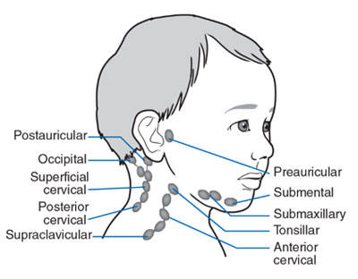

## Introduction
- **Wash hands** (and don PPE if needed)
- **Introduce yourself** (name and role)
- Confirm patient's **name** and **DOB**
- Explain what the examination involves
- Gain consent to continue
- Ask if patient in any **pain** before continuing

## General Inspection

#### Clinical Signs
- Body habitus - slim, obese, cachexic
- Scars
- Jaundice
- Abdominal distension
- Masses
- Pallor 

#### Objects and Equipment
- Stoma bags - location and type
- Vomit bowl
- Surgical drains - note location and type/volume of contents
- Feeding tubes NG or NJ 
- Medical equipment - oxygen, ECG, medications, catheters (note volume and colour), IV access 
- Mobility aids 
- Vital sign charts 
- Fluid balance charts 
- Prescriptions

## Hands

#### Inspection
- [[Koilonychia]] - iron-deficiency anaemia (malabsorption, Crohn's) & [[leukonychia]] - hypoalbuminaemia (5+)
- Palmar erythema (redness) - chronic liver disease, [[Pregnancy]]
- Dupuytren's contracture - thickening of palmar fascia $\rightarrow$ alcoholic liver disease

##### Finger [[Clubbing]]
Most likely causes to come up in abdo exam OSCE is [[inflammatory bowel disease]], [[Coeliac Disease]], [[Liver Cirrhosis]] and lymphoma of GI tract
- Schamroth’s window test

##### Asterixis (flapping tremor)
In context of abdo exam most likely underlying cause is [[hepatic encephalopathy]] (due to hyperammonaemia) or uraemia secondary to renal failure. $CO_2$ retention is another possible cause.
- Ask patient to stick arms out and cock hands back for 30 seconds

#### Palpation

##### Temperature
Place dorsal aspect of your hand onto patients to assess temperature

##### Radial Pulse - Rhythm and Rate
- 30 seconds and x2

## Arms and Axillae

#### Arms
**Inspect** the patient’s **arms** for the following:

- Bruising - clotting problem due to liver disease
- Excoriations - sign of pruritis indicated cholestasis
- Needle track marks - IV drug user - [[Hepatitis]]
- Acanthosis nigricans in axillae - [[Diabetes Mellitus]], gastric cancer (or other GI malignancy)
- Hair loss in axillae - due to iron-deficiency anaemia and malnutrition

## Face

- Telangiectasia - widened blood vessels - stigmata of liver disease/alcohol use
- Pallor - GI bleed due to loss of blood - anaemia

#### Eyes
-   Conjunctival pallor: underlying anaemia
-   Jaundice: most evident in the superior portion of the sclera (ask the patient to look downwards as you lift their upper eyelid) - liver disease.
-   Corneal arcus: a hazy white, grey or blue opaque ring located in the peripheral cornea. In older patients, the condition is considered benign, however, if patient &lt 50 - underlying hypercholesterolaemia.
-   Xanthelasma: yellow, raised cholesterol-rich deposits around the eyes associated with hypercholesterolaemia.
-   Kayser-Fleischer rings: dark rings that encircle the iris associated with [[Wilson’s disease]]. The disease involves abnormal copper processing by the liver, resulting in accumulation and deposition in various tissues (causing [[Liver Cirrhosis]]).

#### Lips & Tongue

-        Lips - peripheral cyanosis  
-        Under the tongue - central cyanosis, hypoxaemia maybe due to blood shunt
-        Angular stomatitis – anaemia
-        Ulcers (aphthous) – iron/B12/folate deficiency, Crohn’s disease
-        Glossitis - iron/B12/folate deficiency due to IBD
-        Odour – ketosis, uraemia, fetor hepatica (breath smells due to liver disease)

#### Lymph Nodes
The left supraclavicular lymph node (Virchow's node) receives lymphatic drainage from the abdominal cavity so can be one of the first signs of intraabdominal malignancy

1. Submental
2. Sub-mandibular
3. Post and pre-auricular
4. Occipital
5. Anterior and posterior cervical
6. Supraclavicular 

## Chest

#### Inspect

-   Spider naevi: skin lesions caused by increased levels of circulating oestrogen. Can be a normal finding in pregnancy or in women taking the combined oral contraceptive pill. If more than 5 are present it is more likely to be associated with pathology such as [[Liver Cirrhosis]].
-   Gynaecomastia: enlargement of male breast tissue caused by increased levels of circulating oestrogen (e.g. liver cirrhosis). Other causes include medications such as digoxin and spironolactone.
-   Hair loss: also caused by increased levels of circulating oestrogen. General malnourishment can also result in hair loss.

## Abdomen

Position the patient lying flat on the bed.
#### Inspect
- Scars - past surgery
- Abdominal distension - **six f's**: fat, fluid, flatus, faeces, foetus or funking large tumour
- Caput medusae - engorged paraumbilical veins associated with portal hypertension
- Striae - stretch marks - [[Liver Cirrhosis|ascites]], intrabdominal malignancy, [[Cushing's Syndrome]], [[Obesity]], [[Pregnancy]]
- Hernias - ask patient to cough
- Cullen's Turners - pancreatitis 

## Abdominal Palpation
Ask the patient if they are aware of any areas of abdominal pain (if present examine last). Keep good eye contact to look for discomfort. 

![[z_attachments/Pasted image 20231204145145.png|211]]
### Light Palpation of the Abdomen
- Tenderness 
- Rebound tenderness: said to be present when the abdominal wall, having been compressed slowly, is released rapidly and results in sudden sharp abdominal pain. Weakly associated with peritonitis
- Voluntary guarding: contraction of the abdominal muscles in response to pain
- Involuntary guarding/rigidity: involuntary tension in the abdominal muscles that occurs on palpation associated with peritonitis (e.g. appendicitis, diverticulitis).
- Masses: large or superficial masses (e.g. hernias) may be noted on light palpation.

### Deep Palpation
Warn the patient this may feel uncomfortable - carefully monitor face
If any **masses** are identified during deep palpation, assess the following characteristics:

-   **Location:** note which of the nine abdominal regions the mass located within.
-   **Size and shape:** assess the approximate size and shape of the mass.
-   **Consistency:** assess the consistency of the mass (e.g. smooth, soft, hard, irregular).
-   **Mobility:** assess if the mass appears to be attached to superficial or underlying structures.
-   **Pulsatility:** note if the mass feels pulsatile, suggestive of vascular aetiology (e.g. abdominal aortic aneurysm).

#####  Palpate Liver
1. Begin in right iliac fossa starting using flat edge of right hand
2. Ask patient to take deep breath in palpate on the inspiration and see if can feel edge of liver
3. Repeat process moving 1-2cm superiorly each time
4.  If you are able to identify the **liver edge**, assess the following characteristics:
	- Degree of extension below the costal margin: if greater than 2 cm this suggests hepatomegaly.
	- Consistency of the liver edge: a nodular consistency is suggestive of cirrhosis.
	- Tenderness: hepatic tenderness may suggest hepatitis or cholecystitis (as you may be palpating the gallbladder)
	- Pulsatility: pulsatile hepatomegaly is associated with tricuspid regurgitation.

##### Palpate Gallbladder
In healthy individuals the gallbladder isn't usually palpable. If palpable suggests enlargement secondary to biliary flow obstruction and/or infection ([[Cholecystitis]])
**Murphy's sign**
1. Position fingers at the right costal margin in mid-clavicular line
2. Ask patient to take a deep breath
3. If patient suddenly stops mid-breath due to pain, suggests [[Cholecystitis]] - Murphy's sign positive

##### Palpate the Spleen
- Same process and beginning as liver but move towards left costal margin instead of right
In healthy individuals you should not be able to palpate the spleen.

##### Ballot the Kidneys
1. Place hands in this position and push fingers together

2. Ask patient to take a deep breath and feel for kidney moving down
3. If kidney ballotable describe size and consistency
4. Repeat on other side
In healthy individuals the kidneys are not usually ballotable but in low BMI patients might be possible
-   Bilaterally enlarged, ballotable kidneys can occur in [[Polycystic Kidney Disease]] or [[amyloidosis]].
-   A unilaterally enlarged, ballotable kidney can be caused by a renal tumour.

##### Palpate the Aorta
**1.** Using both hands perform deep palpation just superior to the umbilicus in the midline.
**2.** Note the movement of your fingers should be superiorly not laterally which might suggest an expansile mass (AAA)

##### Palpate the Bladder
Warm might be uncomfortable and made cause the urge to go to the toilet.
A distended bladder can be palpated in the **suprapubic area** arising from behind the **pubic symphysis** (e.g. urinary obstruction/retention). In most healthy patients who are passing urine regularly, the bladder will **not** be palpable.
- Use side of left hand to palpate from umbilical region downwards

## Abdominal Percussion

##### Percuss the Liver
1. Start at right iliac fossa and percuss towards **right costal margin** until the percussion note changes to dull
2. Continue to percuss upward until the note changes back to resonant indicating the upper border
3. Determine approximate size of liver

##### Percuss the Spleen
1. Start at right iliac fossa and percuss towards **left costal margin**
2. The spleen should not be identifiable using percussion in healthy patients

##### Percuss the Bladder
1. Percuss downwards in the midline from the umbilical region towards the pubic symphysis
2. A distended bladder will be dull to percussion

##### Assess Shifting Dullness
1. Percuss from the umbilical region to patients left flank - if dullness noted - may suggest ascitic fluid
2. Whilst keeping fingers over the area at which the note became dull, ask patient to roll onto their side
3. Keep patient on their side for 30 seconds and then repeat percussion over the same area
4. If ascites is present the area should now be resonant 

## Abdominal Auscultation

#### Assess Bowl Sounds
**Auscultate** over **at least two** **positions** on the abdomen to **assess bowel sounds**:

-   Normal bowel sounds: typically described as gurgling (listen to an example in our video demonstration)
-   Tinkling bowel sounds: typically associated with bowel obstruction.
-   Absent bowel sounds: suggests ileus which is a disruption of the normal propulsive ability of the intestine due to a malfunction of peristalsis.

#### Listen for Bruits
**Auscultate** over the **aorta** and **renal arteries** to identify **vascular** **bruits** suggestive of turbulent blood flow:

-   **Aortic bruits:** auscultate 1-2 cm superior to the umbilicus, a bruit here may be associated with an abdominal aortic aneurysm.
-   **Renal bruits:** auscultate 1-2 cm superior to the umbilicus and slightly lateral to the midline on each side. A bruit in this location may be associated with renal artery stenosis.

## Legs
Assess the patient’s **lower legs** for evidence of **pitting oedema** which may suggest **hypoalbuminemia** (e.g. [[Liver Cirrhosis]], protein-losing enteropathy).

## To Complete the Exam
- **Explain** to the patient that the examination is now **finished**.
- **Thank the patient** for their time.
- **Dispose of PPE** appropriately and **wash your hands**.
- **Summarise** your findings.

## Further Assessments and Investigations
-   Check hernial orifices (e.g. if there are signs of bowel obstruction). 
-   If there is suspicion of gastrointestinal bleeding perform a PR exam.
-  To rule out testicular torsion or indirect inguinal hernia a external genitalia exam may be needed

