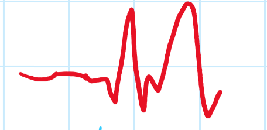

Previously known as acute renal failure.
Usually doesn't occur in isolation

**Stages**

| Stage | Creatinine                                                                | Urine Output              |
| ----- | ------------------------------------------------------------------------- | ------------------------- |
| 1     | SCr increase >26 $\mu$mol/L within 48hr or SCr increase 1.5-1.9x baseline | <0.5mL/kg/hr for 6 hours  |
| 2     | SCr 2-2.9x increase from baseline                                         | <0.5mL/kg/hr for 12 hours |
| 3     | SCr 3x increase etc, SCr increase $\geq$ 354, initiated on RRT            | <0.3mL/kg/hr for 24 hrs   |

## Causes/Factors

Lots of risk factors like age 75+, [[Diabetes Mellitus]], [[Heart Failure]], etc

**Pre-renal** - something causes $\downarrow$ BP

- vomiting
- Diarrhoea
- Diuretics
- Haemorrhage
- Burns
- Renal Artery Stenosis

**Intrinsic** - something within the kidney

- NSAIDS
- Nephrotoxins
- [[Glomerulonephritis]]
- Vascular

**Post-renal**

- Kidney stones
- Tumours
- Retroperitoneal fibrosis

## Clinical Presentation

- AKI is usually a silent disease
- Possibly kidney stones
- Always suspect in acute patients with risk factors

## Diagnostic Tests

- FBC, U&E and bicarbonate, C reactive protein (CRP), LFTs
- Calcium & phosphate
- Creatine kinase
- Urinalysis
- Ultrasound if suspected obstruction
- Biopsy

## Management

- Manage underlying cause of AKI
- Supportive - renal (kidney) replacement therapy
  - hyperkalaemia - non-responsive to medicine
  - pH <7.1
  - high urea

## Complications/red Flags

**Refractory Hyperkalaemia**

- Leads to tented T-wave
  
- Give calcium gluconate -> protects heart and buys time, glucose/dextrose + insulin and possible salbutamol nebuliser

**Acidosis**

**Uraemic symptoms**

- nausea
- pruritis
- malaise

**Therapy-resistant fluid overload**
