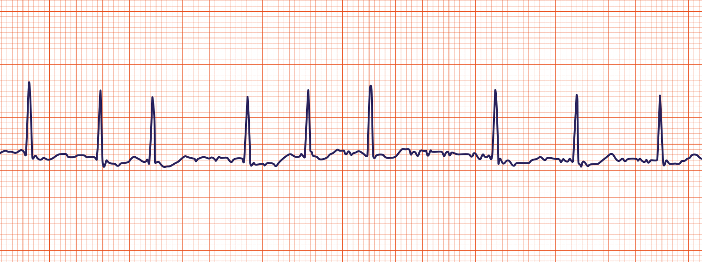

A rapid irregular atrial rhythm at 300-600 bpm. The AV node blocks most of these impulses and only responds intermittently (hence irregular QRS). Cardiac output is reduced by 10-20% as ventricles are not primed properly by atria

Main risk is from clots forming from pooling blood in atria leading to ischaemic [[Stroke]]

## Causes/Factors

- [[Essential hypertension|Hypertension]]
- [[Coronary Artery Disease]]
- Excessive alcohol consumption
- [[Hyperthyroidism]]
- [[Heart Failure]]
- [[pneumonia]]

## Symptoms

- Chest pain
- Palpitations
- Dyspnoea
- Syncope/pre-syncope
- May be asymptomatic

## Signs

- Irregularly irregular pulse
- 1st heart sound is of variable intensity
- Signs of underlying cause

## Diagnostic Tests

- ECG
  
- Blood: Thyroid function test
- Echo: look at valvular (mitral/aortic) and LV function

| Paroxysmal | Persistent | Permanent |
| ---- | ---- | ---- |
| Episodes lasting >30 seconds but <7 days (often less than 48 hours) | Episodes lasting >7 days | Longstanding >1 year |
| Self-terminating | Not self-terminating |  |
| Recurrent |  |  |

## Management

### Adverse features
Atrial fibrillation in patients with the follow should be defibrillated using synchronised DC cardioversion:
- Heart failure
- Myocardial ischaemia 
- Shock
- Syncope

![[z_attachments/Pasted image 20240131141429.png]]

## Paroxysmal AF
For intermittent short duration AF, "pill-in-the-pocket" strategy can be used. Patient can take a pharmacological cardioversion only when they feel symptoms of AF begin. 

Rate control - slows down the heart rate to prevent symptom of palpitations and improve heart beat efficiency

![[z_attachments/Pasted image 20240131141504.png]]
- $\beta$ blocker
- Calcium channel blockers (diltiazem, verapamil)
- Digoxin

Rhythm control - convert the hearth rhythm back into sinus rhythm

- Amiodarone
- Electric (DC) cardioversion

  _No real difference in prognosis between rate or rhythm control_

Anticoagulation - CHA$_2$DS$_2$-VASc score to determine whether to anticoagulate in AF

**C**ongestive cardiac failure (1 point)
**H**ypertension (1)
**A**ge 65-74 (1)
**A**ge 74+ (2)
**D**iabetes (1)
**S**troke/TIA/thromboembolism (2)
**Va**scular disease (1)
**S**ex **C**ategory (1 if female)

A score of 2 = annual stroke risk of ~2-4%
3 = 3-6% risk

Increased chance of bleeding but bleeding is a better outcome than a stroke
