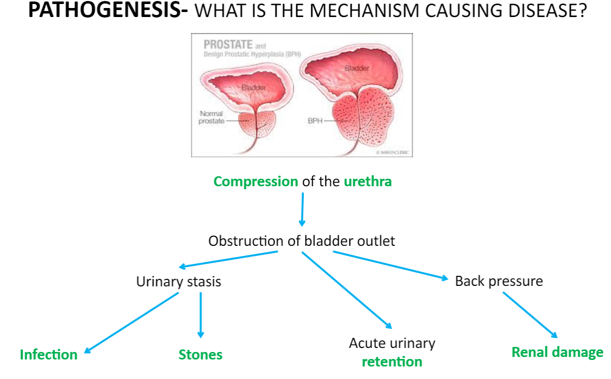

Increased number of both stromal and glandular cells in the prostate

## Causes/Factors

- Old men
- Obesity
- Diabetes
- FH

## Clinical Features

- Lower urinary tract symptoms

## Diagnostic Tests

## Management

## Complications/red Flags
