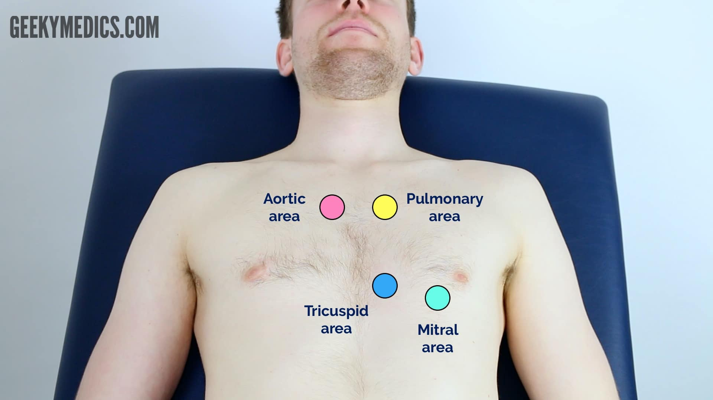
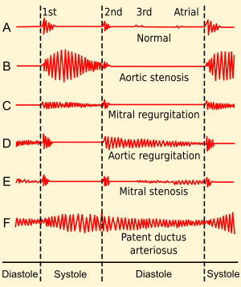

## Introduction

- **Wash hands** (and don PPE if needed)
- **Introduce yourself** (name and role)
- Confirm patient's **name** and **DOB**
- Explain what the examination involves
- Gain consent to continue
- Ask if patient in any **pain** before continuing

## General Inspection

#### Clinical Signs

- **Cyanosis**
- **Shortness of breath** (congestive [[Heart Failure]], [[Pericarditis]] [[pneumonia]], [[pulmonary embolism]])
- Pallor - not very sensitive - paleness -> anaemia (haemorrhage, chronic disease) or poor perfusion (congestive [[Heart Failure]])
- **Malar flush** - plum red discolouration of the cheeks associated with [[Mitral stenosis]]
- **Oedema** - lots of causes, usually in limbs (pedal) or abdomen (ascites). Usually in context of CVS exam congestive [[Heart Failure]]

#### Objects and Equipment

- Medical equipment - oxygen, ECG, medications, catheters (note volume and colour), IV access
- Mobility aids
- Pillows - congestive [[Heart Failure]] patients typically suffer from orthopnoea
- Vital sign charts
- Fluid balance charts
- Prescription

## Hands

#### Inspection

- Colour - pallor -> poor peripheral perfusion and cyanosis
- Tar staining
- Xanthomata - yellow cholesterol-rich deposits
- Arachnodactyly - fingers and toes abnormally long and slender, feature of [[Marfan's syndrome]] mitral/aortic valve prolapse & aortic dissection
- [[Splinter haemorrhages]] - local trauma, infective endocarditis, sepsis, vasculitis
- [[Janeway lesions and Osler's nodes]]

##### Finger [[Clubbing]]

Could indicate congenital cyanotic heart disease, infective [[Endocarditis]], and [[atrial myxoma]]

- Schamroth’s window test

#### Palpation

##### Temperature

Place dorsal aspect of your hand onto patients to assess temperature

##### Capillary Refill time

- Apply 5 seconds of pressure onto finger and release
- Should return in <2 seconds
- If >2 seconds suggests poor peripheral perfusion (hypovolaemia, congestive heart failure) and need to assess central cap refill

##### Radial Pulse - Rhythm and Rate

- 30 seconds and x2
- Irregular rhythm is most commonly caused by [[Atrial Fibrillation]]

##### Radio-radial Delay

Palpate both radial pulse together. If out of sync +ve test. Causes include:

- Subclavian artery stenosis (e.g. compression by a cervical rib)
- Aortic dissection
- Aortic coarctation

##### Collapsing Pulse

A collapsing pulse is a forceful pulse that **rapidly increases** and subsequently **collapses**.
**_Ask patient if in any pain in shoulder as going to have to move it rapidly_**
Causes of a collapsing pulse:

- Normal physiological states (e.g. fever, pregnancy)
- Cardiac lesions (e.g. aortic regurgitation, patent ductus arteriosus)
- High output states (e.g. anaemia, arteriovenous fistula, thyrotoxicosis)

##### Blood Pressure

In a cardiovascular examination OSCE station, you are **unlikely** to have to carry out a thorough blood pressure assessment due to time restraints, however, you should demonstrate that you have an awareness of what this would involve.

## Neck

#### Carotid Pulse

##### Auscultate

Prior to palpating the carotid artery need to rule out the presence of a **bruit**.

1. Place bell of stethoscope over carotid pulse
2. Ask patient to take a deep breath in and hold
3. Sound of a carotid bruit
   ![[z_attachments/Carotid Bruit Sound.mp3|Carotid Bruit Sound]]
4. The presence of a ‘carotid bruit’ may, in fact, be a **radiating cardiac murmur**

##### Palpate

If no bruits were identified, proceed to **carotid pulse palpation**:
1. Ensure the patient is positioned safely on the bed, as there is a risk of inducing reflex bradycardia when palpating the carotid artery (potentially causing a syncopal episode).
2. Place fingers on carotid
3. Assess the **character** (e.g. slow-rising, thready) and **volume** of the pulse.

#### Jugular Vein

##### Jugular Venous Pressure

Indirect measure of central venous pressure (IJV connects to right atrium without any valves). Causes include [[Heart Failure]], [[Tricuspid regurgitation]] and constrictive [[Pericarditis]]

1. Position the patient in a semi-recumbent position (at 45°).
2. Ask the patient to turn their head slightly to the left
3. Inspect for evidence of IJV running between the medial end of the clavicle and the ear lobe, under the medial aspect of the sternocleidomastoid
4. Measure the JVP by assessing the vertical distance between the **sternal angle** and the **top of the pulsation point of the IJV** (in healthy individuals, this should be **no greater than 3 cm**).

##### Hepatojugular Reflux Test (not Performed in an OSCE)

The hepatojugular reflux test involves the application of pressure to the liver whilst observing for a sustained rise in JVP.

- In healthy individuals, this rise should last **no longer than 1-2 cardiac cycles** (it should then fall).
- If the rise in JVP is **sustained** and **equal to or greater than 4cm** this is deemed a **positive result**.

A **positive hepatojugular reflux result** suggests the **right ventricle is unable to accommodate an increased venous return**, but it is **not diagnostic** of any specific condition. Constrictive [[pericarditis]], right and left ventricular failure and restrictive [[cardiomyopathy]] can cause a positive result

## Face

#### Eyes

- **Conjunctival pallor:** suggestive of underlying anaemia. Ask the patient to gently pull down their lower eyelid to allow you to inspect the conjunctiva.
- **Corneal arcus:** a hazy white, grey or blue opaque ring located in the peripheral cornea. In older patients, the condition is considered benign, however, if patient <50 - underlying hypercholesterolaemia.
- **Xanthelasma:** yellow, raised cholesterol-rich deposits around the eyes - hypercholesterolaemia.
- **Kayser-Fleischer rings:** dark rings that encircle the iris associated with [[Wilson’s disease]]. The disease involves abnormal copper processing by the liver, resulting in accumulation and deposition in various tissues (including the heart where it can cause [[cardiomyopathy]]).

#### Mouth

- **Central cyanosis:** bluish discolouration of the lips and/or the tongue associated with hypoxaemia (e.g. a right to left cardiac shunt)
- **Angular stomatitis:** a common inflammatory condition affecting the corners of the mouth. It has a wide range of causes including iron deficiency.
- **High arched palate:** a feature of [[Marfan's syndrome]] which is associated with mitral/aortic valve prolapse and aortic dissection.
- **Dental hygiene:** poor dental hygiene is a risk factor for infective [[Endocarditis]]

## Chest

#### Inspect

- **Scars suggestive of previous thoracic surgery**
- **Pectus excavatum:** a caved-in or sunken appearance of the chest.
- **Pectus carinatum:** protrusion of the sternum and ribs.
- **Visible pulsations:** a forceful apex beat may be visible secondary to underlying ventricular hypertrophy.

### Palpation

##### Apex Beat

- Typically located in 5th intercostal space in midclavicular line
- Displacement of apex beat from its usual location can occur due to anything that shifts mediastinum

##### Heaves

A **parasternal heave** is a precordial impulse that can be palpated.

- Place the **heel of your hand** parallel to the **left sternal edge** (fingers vertical) to palpate for heaves.
- If heaves are present you should feel the heel of your hand being **lifted** with each systole.
- Parasternal heaves are typically associated with **right ventricular hypertrophy**.

##### Thrill

A **thrill** is a **palpable vibration** caused by **turbulent blood flow** through a heart valve (a thrill is a palpable murmur).
You should assess for a thrill across **each of the heart valves** in turn

### Auscultation

1. Palpate the carotid pulse to determine the first heart sound.
2. Auscultate ‘upwards’ through the valve areas using the **diaphragm** of the stethoscope whilst continuing to palpate the carotid pulse:

- **Aortic valve:** 2nd intercostal space at the right sternal edge.
- **Pulmonary valve:** 2nd intercostal space at the left sternal edge.
- **Tricuspid valve:** 4th or 5th intercostal space at the lower left sternal edge.
- **Mitral valve:** 5th intercostal space in the midclavicular line.

3. Possibly repeat with bell?

##### Accentuation Manoeuvres

- **Aortic stenosis** - auscultate the **carotid** **arteries** using the diaphragm of the stethoscope whilst the patient holds their breath to listen for radiation of an **ejection systolic murmur**
  ![[z_attachments/Aortic Stenosis normal speed.mp3|Aortic Stenosis normal speed]]
- **Aortic regurgitation** - sit the patient forwards and auscultate over the **aortic** **area** with the diaphragm of the stethoscope during **expiration** to listen for an **early diastolic murmur**
  ![[z_attachments/Aortic Regurgitation normal speed.mp3|Aortic Regurgitation normal speed]]
- **Mitral regurgitation** - roll the patient onto their **left side** and listen over the mitral area with the **diaphragm** of the stethoscope **during expiration** for a pansystolic murmur. Continue to auscultate into the **axilla** to identify **radiation** of this murmur.
  ![[z_attachments/Mitral Regurgitation normal speed.mp3|Mitral Regurgitation normal speed]]
- **Mitral stenosis** - with the patient **on their left side,** listen over the **mitral area** using the **bell** of the stethoscope **during expiration** for a **mid-diastolic murmur**.
  ![[z_attachments/Mitral Stenosis normal speed.mp3|Mitral Stenosis normal speed]]

## Final Steps

#### Posterior Chest Wall

- Inspect the posterior chest wall for any deformities or scars

##### Auscultation

Auscultate the lung fields posteriorly:

- Coarse crackles -> [[pulmonary oedema]]
- Absent air entry and stony dullness on percussion -> [[Pleural Effusion]]

##### Sacral Oedema

Inspect and palpate the sacrum for evidence of pitting oedema.

#### Legs

- **Inspect** and **palpate** the patient’s **ankles** for evidence of **pitting pedal oedema** and temperature (associated with right ventricular failure).
- **Inspect** the patient’s **legs** for evidence of **saphenous vein harvesting** (performed as part of a coronary artery bypass graft).

## To Complete the Exam

- **Explain** to the patient that the examination is now **finished**.
- **Thank the patient** for their time.
- **Dispose of PPE** appropriately and **wash your hands**.
- **Summarise** your findings.

> [!INFO] Example summary
> _“Today I examined **Mrs Smith**, a **64-year-old female**. On **general inspection**, the patient appeared comfortable at rest and there were no objects or medical equipment around the bed of relevance.”_
>
> _“The **hands** had no peripheral stigmata of cardiovascular disease and were symmetrically warm, with a normal capillary refill time.”_
>
> _“The **pulse** was regular and there was no radio-radial delay. On auscultation of the carotid arteries, there was no evidence of carotid bruits and on palpation, the carotid pulse had normal volume and character.”_
>
> _“On **inspection of the face**, there were no stigmata of cardiovascular disease noted in the eyes or mouth and dentition was normal.”_ >_“**Assessment of the JVP** did not reveal any abnormalities and the hepatojugular reflux test was negative.”_
>
> _“**Closer inspection of the chest** did not reveal any scars or chest wall abnormalities. The apex beat was palpable in the 5th intercostal space, in the mid-clavicular line. No heaves or thrills were noted.”_
>
> _“**Auscultation of the precordium** revealed normal heart sounds, with no added sounds.”_ >_“There was no evidence of peripheral **oedema** and **lung fields** were clear on auscultation.”_
>
> _“In **summary**, these findings are consistent with a **normal** **cardiovascular** **examination**.”_ >_“For completeness, I would like to perform the following **further assessments** and **investigations**.”_

## Further Assessments and Investigations

- Measure BP
- Peripheral vascular examination
- 12 lead ECG - look for evidence of arrythmias
- Dipstick urine - proteinuria or haematuria associated with hypertension
- Capillary blood glucose - checking for DM
- Fundoscopy - concerns about malignant hypertension
