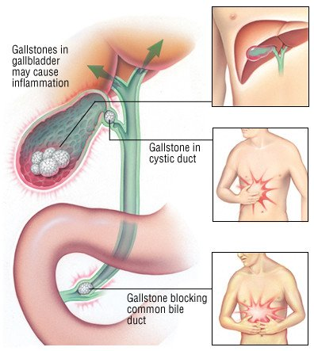

Acute cholecystitis refers to the **acute inflammation** of the **gallbladder**, with 90% of cases being **secondary to gallstones**.

## Causes/Factors

Gallstone blockage
- Age
- Obesity
- Smoking
- low fibre intake

## Symptoms

|                     | **RUQ Pain** | **Fever/$\uparrow$WCC** | **Jaundice** |
| ------------------- | ------------ | ----------------------- | ------------ |
| [[Biliary colic]]       | $\checkmark$ | X                       | X            |
| Acute cholecystitis | $\checkmark$ | $\checkmark$            | X            |
| [[Acute cholangitis]]         | $\checkmark$ | $\checkmark$            | $\checkmark$ |

- Worsening of pain/symptoms after eating fatty food
- nausea, vomiting
- RUQ pain - radiating round side / to back

## Signs

- Murphy's test positive - RUQ pain which may radiate worse on inspiration

## Diagnostic Tests

- WCC, FBC, CRP, LFTs
- USS (and/or CT/MRI abdo)

- magnetic resonance cholangiopancreatography (MRCP)
- endoscopic ultrasound (EUS)

## Management

Patients are usually systemically unwell and require hospital admission for oral/IV antibiotics and surgery within 7 days of diagnosis
- antibiotics
- Laparoscopic cholecystectomy

## Complications/red Flags

If in the gallbladder/cystic duct:

- [[Biliary colic]]
- Acute and chronic cholecystitis
- Mucocele
- [[Empyema]]
- Carcinoma
- Mirizzi syndrome

In the bile ducts

- Obstructive [[Jaundice]]
- [[Acute cholangitis]]
- [[Pancreatitis]]
