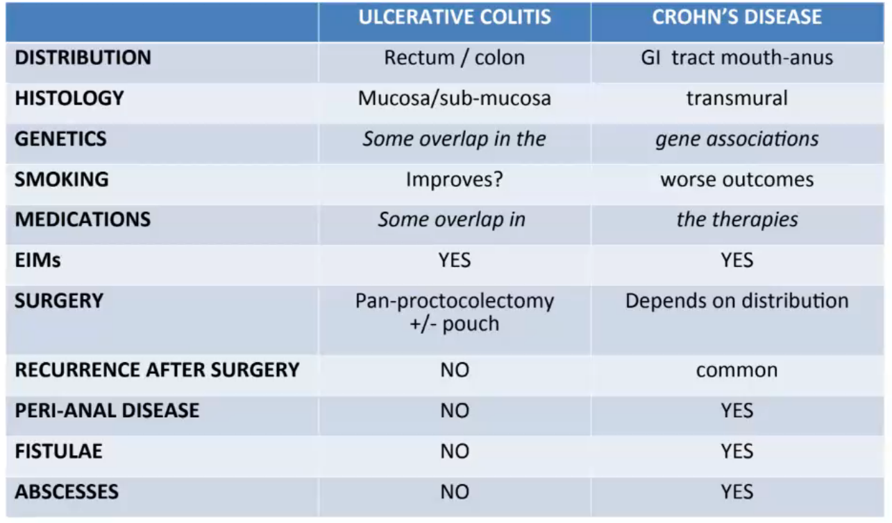
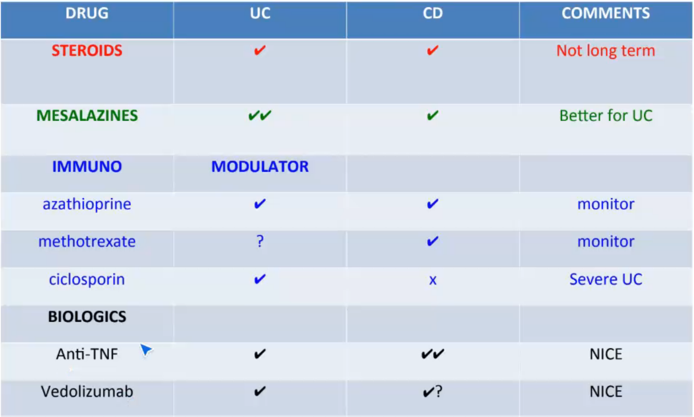
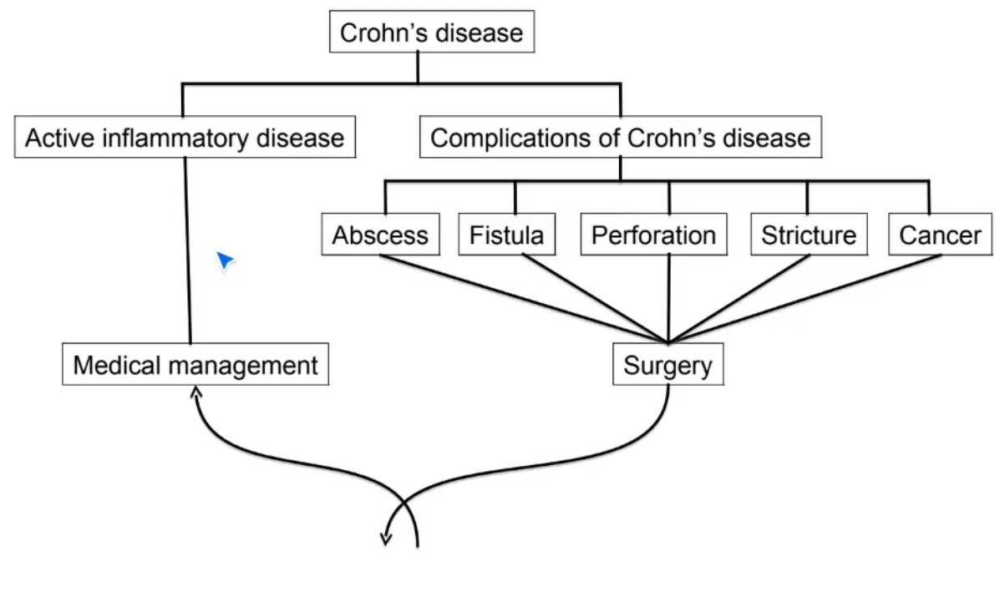

The inflammatory bowel diseases (IBD), [[Ulcerative Colitis]] and Crohn's disease are chronic autoimmune relapsing and remitting inflammation of the intestine.

Can effect any part of GI tract from mouth to anus
More difficult to manage due to this

## Causes/Factors

Inappropriate immune response against (?abnormal) colonic flora in genetically susceptible individuals - failure to maintain tolerance

Smoking $\uparrow$ risk 3-4 times

## Symptoms

- Diarrhoea
- Abdominal pain
- Weight loss/failure to thrive
- Systemic symptoms: pyrexia, malaise, anorexia

## Signs

- bowel ulceration
- abdominal tenderness
- perianal abscess/fistulae/skin tags
- anal strictures
- patchy inflammation

Extraintestinal signs:

- [[clubbing]]
- skin joint and eye problems

## Diagnostic Tests

- Calprotectin - protein released from neutrophils into stool -> inflammatory marker, highly sensitive
- Blood tests for inflammatory markers/anaemia (FBC, ESR, CRP, U&E, LFT)
- Full colonoscopy or sigmoidoscopy -> biopsy
- Crypt abcesses on histology
- AXR - no feacal shadows, mucosal thickening/islands

## Management

**Optimise nutrition**

- Azathioprine (immunosuppressant)
- Biologics, Anti-TNFa, Anti-integrin, anti-IL12/23
- Surgery due to complications

## Complications/red Flags

- small bowel obstruction
- toxic dilation
- for rest see diagram
