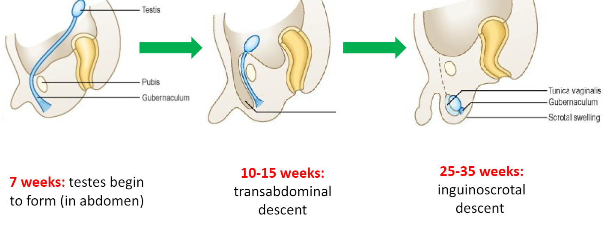

Cryptorchidism, also known as undescended testis, is a condition in which one or both testicles do not descend into the scrotum during fetal development. Normally, the testes develop in the abdomen and gradually descend into the scrotum before birth or shortly thereafter. In cases of cryptorchidism, the testicle(s) remain in the abdomen, groin, or along the pathway of descent.

Many babies can be born within the 25-35 week window without testis decent

## Causes/Factors

- **Hormonal Imbalance:** Insufficient production of hormones that aid testicular descent.
- **Premature Birth:** Testicles may not have had enough time to descend before birth.
- **Genetic Factors:** Family history may play a role.
- **Other Medical Conditions:** Conditions affecting the testes or hormonal regulation.

## Diagnostic Tests

- **Physical Exam:** A healthcare professional assesses the groin and scrotum for the presence of testicles.
- **Ultrasound:** Imaging to locate the testicle(s) and determine their position.

## Management

1. **Spontaneous Descent:** In some cases, testicles descend on their own within the first few months of life.
2. **Hormone Therapy:** Hormones like human chorionic gonadotropin (hCG) can stimulate descent.
3. **Surgery (Orchiopexy):** Surgical placement of the undescended testicle(s) into the scrotum.
4. **Monitoring:** In mild cases, regular monitoring to ensure spontaneous descent occurs.

## Complications/red Flags

- **Infertility:** Undescended testicles can impact sperm production and fertility.
- [[Seminoma]] regardless of whether it was surgically corrected  
- **Inguinal Hernias**
- **Testicular torsion**
