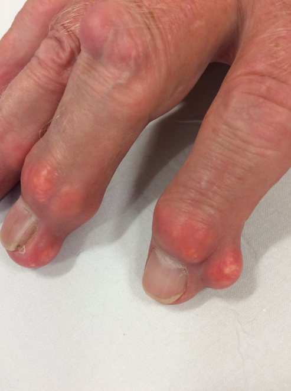

---
tags:
  - Rheumatology
title: Crystal Arthritis
date created: Tuesday, August 1st 2023, 5:40:21 pm
date modified: Wednesday, August 2nd 2023, 10:20:03 pm
aliases: []
---
Crystal arthropathies are a group of joint disorders caused by the formation and deposition of crystals within the joints. The two primary types are gout and pseudogout (calcium pyrophosphate deposition disease).

Approximately 90 percent of first attacks are monoarticular.

## Causes/Factors

- **Gout:**
    - **Hyperuricemia:** Too much uric acid in blood - kidneys not excreting properly, crystallises out in joints
    - **Diet:** High intake of purine-rich foods.
    - **Genetics:** Family history of gout.
    - **Certain Medical Conditions:** Hypertension, diabetes, and kidney disease.
- **Pseudogout:**
    - **Age:** More common in older individuals.
    - **Calcium Pyrophosphate Deposition:** Formation of crystals in the joint fluid.

## Symptoms

- **Sudden Onset of Joint Pain:** In more than one half of patients with acute gout, the first metatarsophalangeal joint is the initial joint involved, a condition known as podagra
- **Swelling and Inflammation:** Redness and warmth over the affected joint.
- **Limited Range of Motion:** Difficulty moving the joint.
- **Recurrent Attacks:** Periods of symptom-free intervals followed by flares.

- Severe pain - can't bare weight
- Feet and knee are classic locations
- Diuretics
- Give good analgesics

## Signs

**Tophi (Gout):** Nodules under the skin containing uric acid crystals.

**Chondrocalcinosis (Pseudogout):** Calcification of joint cartilage seen on imaging.
## Diagnostic Tests

- **Joint Aspiration:** Removing fluid from the affected joint for crystal examination.
- **Blood Tests:** To measure uric acid levels (for gout) and other markers.
- **Imaging:** X-rays, CT scans, or MRI to visualize joint damage.

Gout
- White toothpaste like fluid removed from the joint with syringe

## Management

1. **Medications:**
    - **Nonsteroidal Anti-Inflammatory Drugs (NSAIDs):** For pain and inflammation.
    - **Colchicine:** To reduce inflammation and prevent flares.
    - **Corticosteroids:** Intra-articular injections for severe flares.
    - **Urate-Lowering Medications (for gout):** Allopurinol or febuxostat.
    - **Calcium Pyrophosphate Crystal Deposition Inhibitors (for pseudogout):** Colchicine or NSAIDs.
2. **Joint Aspiration:** To relieve pain and remove crystals.
3. **Lifestyle Modifications:** Dietary changes to reduce purine intake (for gout), and staying hydrated.
4. **Weight Management:** Maintaining a healthy weight.
5. **Avoiding Trigger Foods:** Certain foods may exacerbate gout flares.