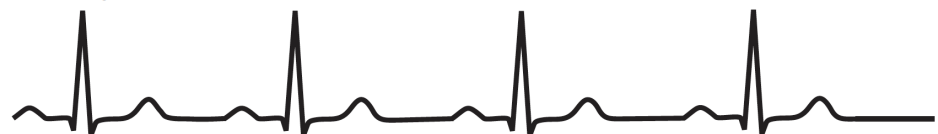
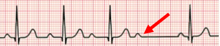
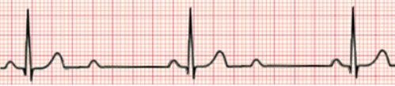
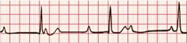

Disrupted passage of electrical impulse through the AVN

1st-degree: prolonged PR interval, unchanging, no missed beats

2nd-degree (Mobitz I): PR interval becomes longer and longer until a QRS is missed. Then the pattern resets

2nd-degree (Mobitz II): QRSs are regularly missed (eg 2:1 block). This is dangerous as it will progress to complete heart block

3rd-degree: Complete heart block. No impulses passed from atria to ventricles -> p waves and QRSs are independent. Tissue distal to AVN then starts initiating contractions but at a much slower rate

## Causes/Factors

- 1st and 2nd Mobitz I may be normal and asymptomatic in athletes or due to $\beta$ blockers or digoxin.
- May also be [[sick sinus syndrome]]
  3rd degree:
- [[Coronary Artery Disease]]
- [[Aortic Valve Calcification]]
- [[Idiopathic Fibrosis]]
- Digoxin toxicity

## Symptoms

- Light-headedness, pre-syncope/syncope
- Chest pain (esp. with co-existent [[Coronary Artery Disease]])
- Signs of [[Heart Failure]]

## Signs

- Bradycardia (<60bpm)
- Hypotension
- Cardiac syncope - losing consciousness for seconds then coming round not knowing what happened

## Diagnostic Tests

- ECG see above

## Management

- Atropine administration (blocks parasympathetic action)
- Rhythm altered drugs
- Pacemaker implantation
