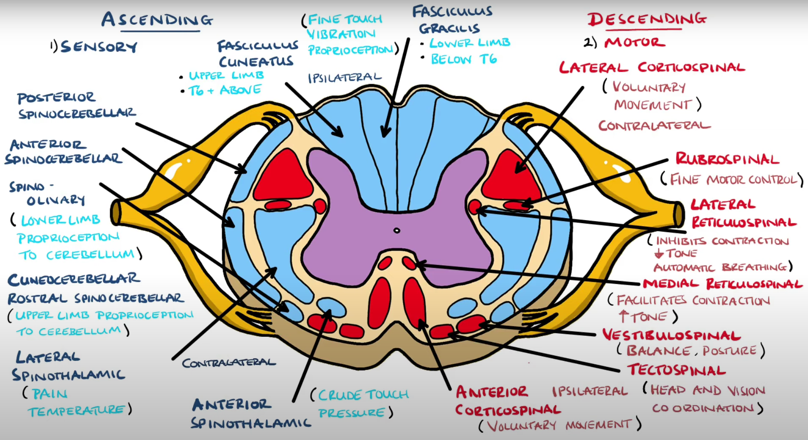
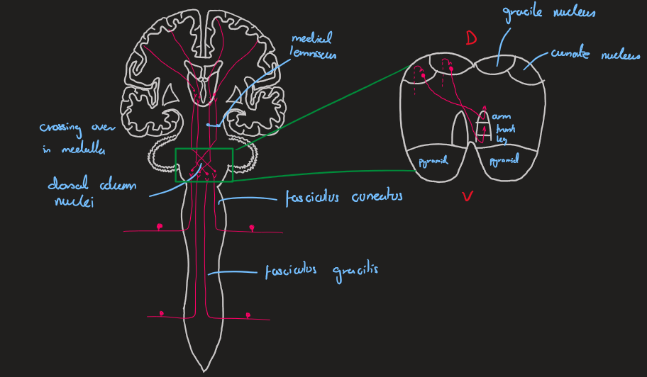
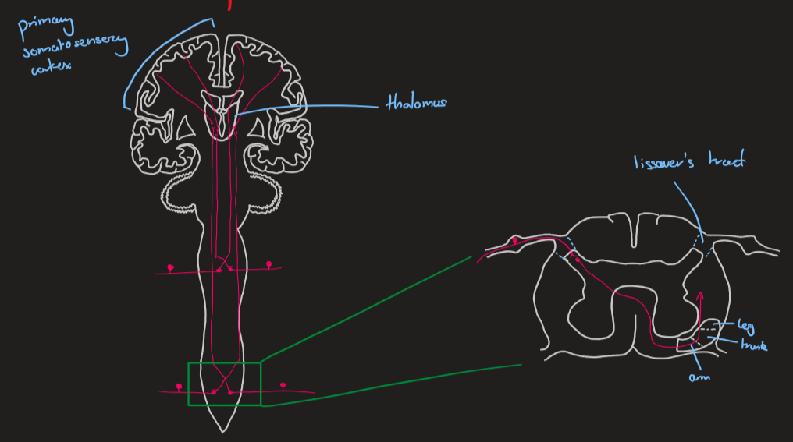
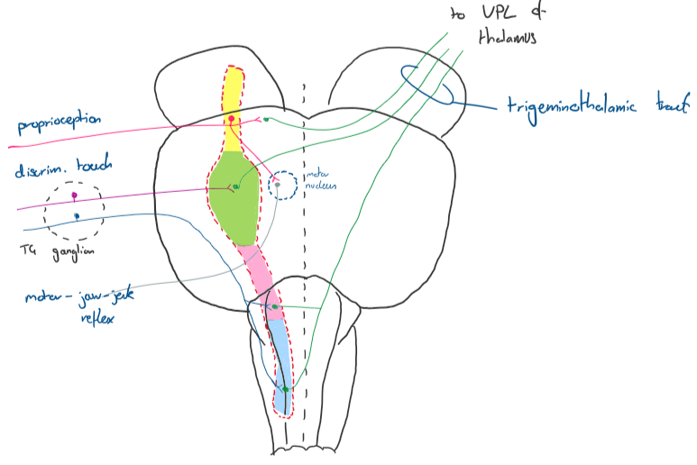
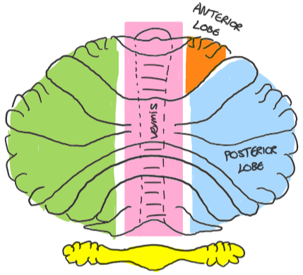
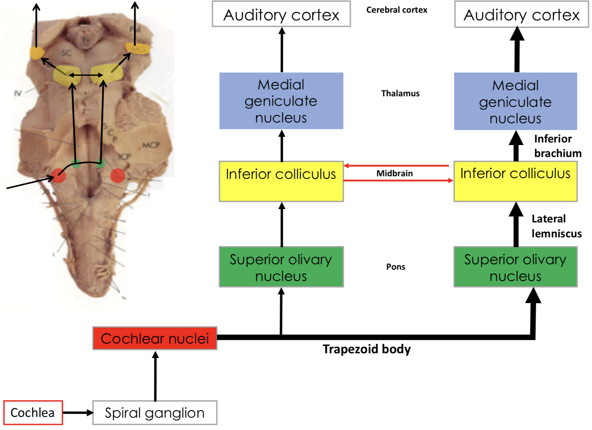
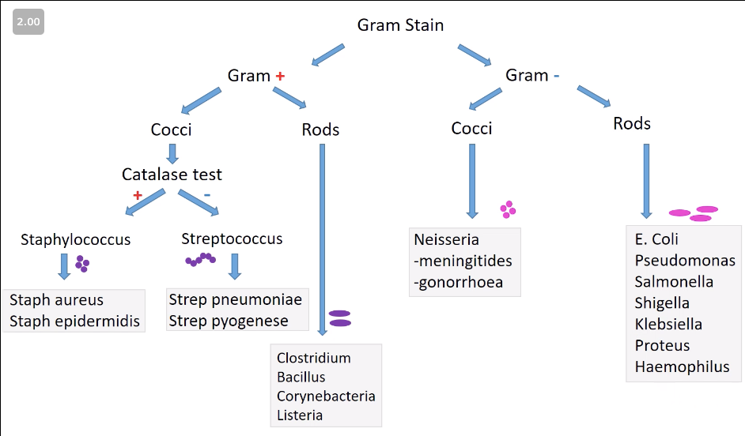
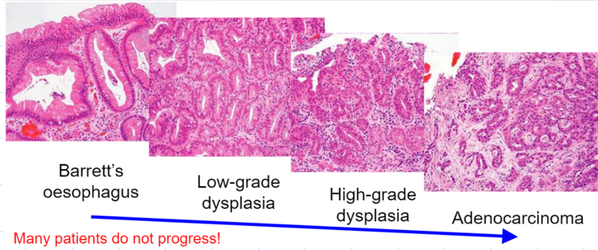

> [!Warning]
> These notes were written before the creation of this website
>
> As such, the layout of this page may be hard to follow

## Movement - Upper limb

- Rotator cuff muscles: supraspinatus, infraspinatus, teres minor, subscapularis
- Radial supplies all extensors
- FDP - medial: ulnar | lateral: median
- Lumbricals - medial 2: ulnar | lateral 2: median
- Median supplies all forearm flexors except for the flexor carpi ulnaris
- Median supplies intrinsic thumb muscles
  - Ulnar supplies the rest

---

## Movement - Lower limb

#### Thigh

- Anterior: femoral nerve | Medial: Obturator | Posterior: Tibial

###### _Exceptions to this_

- Psoas major and minor - anterior rami
- Adductor magnus hamstring part - tibial nerve
- Biceps femoris short head - fibular

---

#### Leg

- Anterior: deep fibular | Lateral: superficial fibular | Posterior: Tibial

- Ankle most stable in dorsiflexion

- Medial rotation of femur in extension - locked and stable

#### Foot

---

## Movement - Head and Neck

- Digastric anterior belly supplied by CN V3
- Digastric posterior belly supplied by CN VII
- Both insert onto intermediate tendon
- Lateral rectus inv. abducens CN VI

- Origin of **rectus** muscles common tendinous ring
- Origin of **oblique** muscles sphenoid (sup) and orbital floor (inf)
- Superior oblique - depresses, abducts and medially rotates
- Inferior oblique - elevates, abducts and laterally rotates

---

## Control - Bony Anatomy

- Pterion formed of joining of parietal, frontal, sphenoid and temporal
  - Trauma $\rightarrow$ ruptured middle meningeal $\rightarrow$ extradural
- Dural folds: falx cerebri, tentorium cerebelli, falx cerebelli
- Sinuses: superior and inferior sagittal sinus, straight sinus transverse sinus, sigmoid sinus, cavernous sinus
- Epidural space occupied by fat in spinal cord

---

| Foramen                      | Structure(s)                 |
| ---------------------------- | ---------------------------- |
| **Superior orbital fissue**  | CN III, IV, $V_1$, VI        |
| **F. rotundum**              | CN $V_2$                     |
| **F. ovale**                 | CN $V_3$                     |
| **F. spinosum**              | middle mengingeal artery     |
| **F. lacerum**               | covered in cartiledge        |
| **Internal auditory meatus** | CN VII, VIII                 |
| **Stylomastoid foramen**     | CN VII exits skull after IAM |
| **Jugular foramen**          | CN IX, X, XI                 |
| **Hypoglossal canal**        | CN XII                       |

---

## Control - Vasculature

| Artery                              | Area                                                                                   |
| ----------------------------------- | -------------------------------------------------------------------------------------- |
| **Anterior cerebral artery supply** | <li> Superior and medial **frontal** and **parietal** </li><li>- Corpus callosum </li> |
| **Middle cerebral artery**          | <li> Lateral **frontal**, **temporal** and **parietal** </li>                          |
| **Posterior cerebral artery**       | <li> Occipital lobe </li> <li> Inferior and medial surface of temporal </li>           |

---

- Extradural $\rightarrow$ torn meningeal artery 🍋
- Subdural $\rightarrow$ torn (bridging) vein 🍌
- Subarachnoid $\rightarrow$ torn cerebral artery (follows gyri and sulci)

---

## Control - Brain anatomy

##### Fibre types

1. Associated fibres - connection areas within a hemisphere eg cingulum
2. Commissural fibres - interconnect areas between hemispheres - eg corpus callosum
3. Projection fibres - inerconnect cerebrum with CNS - eg internal capsule

---

## Control Pathways

---

## Control - Ascending Pathways

##### Dorsal column

- Fine touch, vibration, proprioception
- Runs ipsilaterally - decussate in medulla
- Sensations from **C**ervical neck travel in **C**uneate tubercle
- Sensations from **L**egs (below T6) travel in graci**L**e tubercle

##### Spinothalamic

- Runs contralaterally - decussate in spinal cord (+1/2 levels above entry)

---

**Lateral tract** - pain and temperature
**Anterior tract** - crude touch + pressure

<small>
Dorsal column
</small>

<small>
Spinothalamic
</small>

---

<b>Trigeminal sensory nucleus</b>

- All somatic sensory fibres from the face run within this nucleus to the ventroposteriolateral thalamus

- Mesencephalic nucleus - proprioception
- Pontine - discriminative touch
- Rostral spinal nucleus - simple touch + pressure
- Caudal spinal nucleus - pain and temperature

---

## Control - Decending Pathways

**Pyrimidal tracts** - voluntary movement

-  <b>Lateral corticospinal </b> - 80%

  - Voluntary movement of limbs
  - Contrallateral
  - Descussate at pyramids 

- <b>Anterior corticospinal</b> - 20%
  - Movement of axial muscles
  - **Bilateral innervation**

---

- **Rubrospinal tract** - contralateral fine motor control
- **Reticulospinal tract**
  - Medial - facilitates muscle contraction $\uparrow$ tone
  - Lateral - inhibits contraction $\downarrow$ tone
- **Vestibulospinal tract** - balance and posture
- **Tectospinal tract** - coordination of head movements with vision

---

## Control - Autonomic division

- Only carried within segmental spinal nerves:

  - **Sympathetic** - T1-L2, highly organised, widespread effect. Ganglion in sympathetic chain
  - **Parasympathetic** - CN III, VII, IX, **X**, S2-S4, localised effect. Ganglion near effector organ

- Horner syndrome - injury to sympathetic supply to head and neck
  - Ptosis - drooping eye lids
  - Mitosis - constricted pupil
  - Anhydrosis - loss of sweating

---

### Control - Spinal reflexes

| Reflex                     | Sensory afferent                          | Proposed function                                                              |
| -------------------------- | ----------------------------------------- | ------------------------------------------------------------------------------ |
| Myotactic (stretch) reflex | Muscle spindle - 1a afferent              | Muscle tone maintenence, antigravity/posture movement                          |
| Inverse myotactic          | Golgi tendon organ - 1b afferent          | Controls tension to avoid overcontraction/overstretch                          |
| Flexor withdrawal          | Free nerve endings - A-delta + C afferent | Withdraws limb from offending stimuli, **maintains balance during withdrawal** |

---

### Cerebellum

## Always and completely ipsilateral

---

### Control - Cerebellum

- Vestibulocerebellum (Archicerebellum) - Flocculonodular lobe, part of **vermis**. Balance and eye movements
- Spinocerebellum (Paleocerebellum) - Lateral decending motor execution
- **Vermis** - Medial decending motor execution
- Cerebrocerebellum (Neocerebellum) - motor planning

---

##### Connections:

- Spinocerebellar tracts enter via ICP
- Olivocerebellar afferents from contralateral olivary nucleus via ICP
- Pontocerebellar afferents from contralateral potine nucleus via MCP
- Outputs through SCP decussation

- Crosses over mid-line as fibres have already decussated before reaching cerebellum

---

## Control - visual pathway

- All info goes via lateral geniculate nucleus of thalamus
- Upper visual field goes to lower bank of calcarine sulcus and vice versa

---

## Control - ear

- Ossicles: **M**alleus, **I**ncus, **S**tapes (MIS)
- Oval window transmits the waves, round window releases them
- Hair cells sit on basilar membrane with tips embeded on tectorial membrane

---

**Auditory pathway**

---

- Bilateral - to compared timing and loudness

- **L**ow pitch infomation projects to antero**L**ateral part of primary auditory cotex

- Expressive speech (Broca's area) - motor production of words
- Receptive speech (Wernicke's area) - sensory, understanding

---

## Clinical Pathology

---

---

## _Staph Aureus_ +ve

| Niche | Main Infections                                         | Other                       |
| ----- | ------------------------------------------------------- | --------------------------- |
| Nose  | Skin/soft tissue, bacteraemia, bone/joint, endocarditis | 50% of people carry in nose |

## _Staph Epidermidis_ +ve

| Niche | Main Infections             | Other                                     |
| ----- | --------------------------- | ----------------------------------------- |
| Skin  | Prosthetic device infection | Part of normal skin flora - opportunistic |

---

## _Strep pyogenes_ (Group A Strep) +ve

| Niche   | Main Infections                                                    | Other                                                       |
| ------- | ------------------------------------------------------------------ | ----------------------------------------------------------- |
| Pharynx | Scarlet fever, sore throat, necrotising fasciitis, puerpeal sepsis | Often associated with secondary immunological presentations |

## _Strep pneumoniae_ +ve

| Niche   | Main Infections       | Other                         |
| ------- | --------------------- | ----------------------------- |
| Pharynx | Pneumonia, meningitis | Commonest bact. cause of both |

---

## _C. diff._ +ve

| Niche | Main Infections          | Other                                                      |
| ----- | ------------------------ | ---------------------------------------------------------- |
| Colon | Pseudomembranous colitis | Usually as a result of antibiotic treatment. Opportunistic |

---

## _E. coli_ -ve

| Niche | Main Infections                          | Other                                                                                                            |
| ----- | ---------------------------------------- | ---------------------------------------------------------------------------------------------------------------- |
| Colon | UTIs, intra-abdo infections, sepsis, HUS | Other species of ‘coliform’ e.g. Klebsiella pneumoniae, Enterobacter cloacae, cause similar infections. Bacillus |

---

## _Pseudomonas aeruginosa_ -ve

| Niche | Main Infections  | Other                                  |
| ----- | ---------------- | -------------------------------------- |
| Water | VAP, bacteraemia | Opportunistic bacillus - green pigment |

## _Neisseria meningitidis_ -ve

| Niche   | Main Infections                  | Other                           |
| ------- | -------------------------------- | ------------------------------- |
| Pharynx | Meningococcal sepsis, meningitis | Reduction since vaccine. Coccus |

---

## _Neisseria gonorrhoeae_ -ve

| Niche           | Main Infections                   | Other                                                                    |
| --------------- | --------------------------------- | ------------------------------------------------------------------------ |
| No colonisation | Gonorrhoea, Ophthalmia Neonatorum | Can rarely cause invasive infections (e.g. septic arthritis). Diplococci |

## _Chlamydia trachomatis_ -ve

| Niche           | Main Infections | Other         |
| --------------- | --------------- | ------------- |
| No colonisation | Chlamydia       | Commonest STI |

---

## _Haemophilus influenzae_ -ve

| Niche   | Main Infections                              | Other                                                            |
| ------- | -------------------------------------------- | ---------------------------------------------------------------- |
| Pharynx | RTIs, meningitis, epiglottitis, otitis media | Capsulated types (e.g. type b) cause meningitis and epiglottitis |

## _Mycobacterium tuberculosis_ AFB

| Niche           | Main Infections | Other                  |
| --------------- | --------------- | ---------------------- |
| No colonisation | TB              | Don't gram stain (AFB) |

---

## Fungal Pathogens

---

## Dermatophytes

- Moulds
- Cause superficial infections - cause "tinea" diseases
- Trichophyton rubrum is a common cause of toenail, foot and groin infections

---

## Malassezia

- Dimorphic - change between moulds or yeasts
- Commensal on everyone's skin
- Causes Pityriasis versicolor - hypo or hyper pigmented patches

---

## Candida

- Yeast (dimorphic)
- Cause thrush - disease of oral and vaginal mucosa (fluconazole)
- Candidaemia can lead to occular candidosis and candida endocarditis
- Avoid azole therapy for vaginal thrush in pregnant women
- Opportunistic - $\uparrow$ HIV patients

---

## Aspergillus

- Mould
- Inhaled by everyone but only become a disease in those with immuno/respiratory complications
- Chest imaging important
- Can fill cavity in lung formed by TB
- Agressive IV antifungals

---

## Immunology - Transplant rejection

**Direct alloantigen recognition** - grafted APCs present alloantigens to recipient T cells

**Indirect alloantigen recognition** - grafted cells have alloantigens on surface which recipient APCs bind to and present to T cells

---

## Parasites

---

## Ascariasis

- Distribution - typically 3-8 year olds
- Life cycle - **direct**
- Clinical - Malnutrition & absorption, obstruction - Loeffler's syndrome
- Diagnosis - Eggs in stool microscopy or see worm
- Treatment - albendazole, prevents glucose uptake for worms

---

## Schistosomiasis

Caused by helminths

- Distribution - in water in tropical areas
- Life cycle _indirect_ - snails intermediate host penetrate skin
- Clinical - anameia, _bladder tumours_, cirrhosis, swimmer's itch, Katayama syndrome
- Diagnosis - serology, terminal stream microscopy or stool microscopy
- Treatment - praziquantel

Main parasitic cause of granulomatous chronic inflammation

---

## Strongyloidiasis

Caused by a nematode (helminths)

- Distribution - tropical regions
- Life cycle - faeco-oral route both indirect and direct
- Clinical - abdo pain, eosiniophilia, skin changes, weight loss
- Diagnosis - stool microscopy
- Treatment - albendazole

---

## Echinococcosis/Hyatid disease

- Distribution - global
- Life cycle - indirect via dogs and sheep
- Clinical - abdo pain, chest pain, coughing, SOB, waterlily appearance on CT scan. Rupture can lead to hypersensitivity reaction
- Diagnosis - serology
- Treatment - albendazole

Can form liver or lung cysts

---

## Malaria

P. knowlesi, P. falciparum, P. ovale, P. vivax, P. malariae

- Distribution - sub-Saharan Africa/mosquito living
- Life cycle - indirect via female Anopheles
- Clinical - anaemia, bleeding, DIC, confusion, hypoglycaemia, fevers
- Diagnosis - blood film microsopy, PCR and serolgoy
- Treatment - Quinones,

---

## Cryptosporidium

Common opportunistic pathogen in T cell deficiency

---

## Trichomonas

- STI
- It infects the genitals and may also lead to infection in the: vagina. urethra
- Direct lifecycle
- Metronidazole treatment

---

## Giardia

Similar to cryptosporidiasis but without without reservoir in farm animals

- Distribution - worldwide
- Life cycle - faecal-oral
- Clinical - abdo pain, bloating, diarrhoea, nausea and vomiting 1-3 weeks
- Diagnosis - ELISA, stool sample microscopy
- Treatment - metronidazole

---

## Viruses

---

## Herpes viruses

| Virus | Transmission   | Clinical                             | Latency in          |
| ----- | -------------- | ------------------------------------ | ------------------- |
| HSV-1 | Direct contact | Cold sores, encephalitis             | Trigeminal ganglia  |
| HSV-2 | Direct contact | Genital ulcers, meningitis, neonatal | Sacral ganglia      |
| VZV   | Resp droplet   | Chicken pox, shingles                | whole CNS           |
| EBV   | Saliva/genital | Infectious Mononucleosis             | B cells             |
| CMV   | Saliva/genital | Mononucleosis, congential            | Myeloid progenitors |

---

## Respiratory viruses

| Virus      | Transmission | Clinical                                              | Other                       |
| ---------- | ------------ | ----------------------------------------------------- | --------------------------- |
| Rhinovirus | Resp droplet | Common cold                                           |                             |
| Influenza  | Resp droplet | Primary influenza, post-influenza bacterial pneumonia |                             |
| RSV        | Resp droplet | Bronchiolitis                                         | Commonest in young children |

---

## Hepatitis viruses

| Hepatitis | Transmission     | Clinical                             | Other                                                     |
| --------- | ---------------- | ------------------------------------ | --------------------------------------------------------- |
| A         | Faecal-oral      | Acute hepatitis                      | Poverty, returning travellers, MSM                        |
| E         | Faecal-oral      | Acute hepatitis                      | Pork consumption                                          |
| B         | Sexual, vertical | Acute & chronic hepatitis, cirrhosis | Risk of chronicity inversley related to age at aquisition |
| C         | Sexual, vertical | Acute & chronic, cirrhosis           | IV drug users                                             |
| D         | Sexual, vertical |                                      | Requires Hep B for disease                                |

---

## Transmitted via GIT

| Virus         | Transmission | Clinical                                       | Other                               |
| ------------- | ------------ | ---------------------------------------------- | ----------------------------------- |
| Norovirus     | Faecal-oral  | Profuse vomitting                              | Aerosilised vomit aids spread       |
| Rotavirus     | Faecal-oral  | Diarrhoea and vomitting                        | Vaccine is routine                  |
| Enteroviruses | Faecal-oral  | Polio, fever-rash, meningitis, bad in neonates | Commonest cause of viral meningitis |

---

## Childhood viruses

| Virus          | Transmission | Clinical                                                 | Other                                                       |
| -------------- | ------------ | -------------------------------------------------------- | ----------------------------------------------------------- |
| Mumps          | Resp droplet | Parotiditis, orchitis                                    | Mumps meningoencephalitis can = deafness                    |
| Measles        | Resp droplet | Measles, encephalitis, SSPE                              | Rash starts on face + cough                                 |
| Rubella        | Resp droplet | German measles, congenital rubella                       | Congenital = deafness, bilateral cataracts, cardiac defects |
| Parvovirus B19 | Resp droplet | Erythema infectiosum (red rash on face), aplastic crisis | Infects erythrocyte progenitors                             |

---

## Respiratory

---

## [[Asthma]]

- Reversible intermittent narrowing of _conducting airways_

Changes:

- Thicker wall due to inflammation & tissue hyperplasia
- Narrower lumen due to mucus

SOB, wheeze, cough, hyperinflation

---

## [[Bronchitis]]

- Inflammation of the bronchials - chronic form is part of COPD
- Acute form usually caused by virus in children (Haemophilus influenzae in bacterial)

- Mainly inflammation that causes airway narrowing

## [[Emphysema]]

- Damage to alveoli by breaking down walls between them
- Destruction of elastic fibres

---

## [[COPD]]

Combination of **chronic bronchitis** and **emphysema**

- Chemicals and heat trigger inflammation in bronchi and lung parenchyma $\rightarrow$ scarring, mucus hyperplasia, alveolar wall loss (emphysema)
- Mainly in smokers

---

## [[Bronchiectasis]]

Permanent dilation of bronchi and bronchioles due to wall damage secondary to **chronic necrotising infection**

- Usually triggered by obstruction (tumour, thick mucus in CF) and/or infection
- Obstruction causes infection or infection arises $\rightarrow$ inflammation $\rightarrow$ wall damage, dilation and debris and mucus
- Productive cough - possibly blood

---

## Chronic Interstitial Lung Diseases

Mixed group often scarring +/- inflammation in multiple areas in both lungs that reduces compliance (stiff lungs) = _restrictive_

### Idiopathic [[Pulmonary Fibrosis]]

- Progressive patchy scarring especially lower zones that is fatal
- Repeated epithelial injury $\rightarrow$ inflammation and fibrosis
- Dry cough and progressive SOB

---

### Pneumoconiosis

- Lung damage secondary to particle inhalation: **coal dust, silica, asbestos**
- Occupational exposure
- Particles ingested by macrophages, trigger fibrosis - smoking worsens
- Reduced conducting airways due to dust accumulation and fibrosis

---

### [[Sarcoidosis]]

- Multisystem granulomatous disease that most commonly involves lymph nodes and lungs
- 20-60 most common, all ages & genders globally more in smokers and African and North European descent
- Idiopathetic granulomatous inflammation leading to fibrosis (non-caseating granulommas)
- Nodal enlargement, resp symptoms, constitutional symptoms (fever fatigue, weight loss, sweats)

---

### Hypersensitivity Pneumonitis

- Inflammatory and fibrotic bronchiolar response to inhaled antigens that are not removed
- Chronic inflammation around bronchioles sometimes with intersitial fibrosis
- Resp symptoms, constitutional symptoms

---

## [[Cystic Fibrosis]]

- Abnormally thickened mucous due to chloride channel deletion of a phenylalanine residue - all tubes/mucous places have issues
- Dehydrated mucus that blocks lumen $\rightarrow$ infections, inflammation and scarrinng (S. aureus in childhood, Pseudomonas aeruginosa)
- Bronchitis, bronchiectasis, pancreas - exocrine aatrophy and fibrosis, seminiferous tubules blockage 95% males infertile
- Chronic cough, lung infections malabsorption and eventual right sided heart failure

---

## Primary Malignant [[Lung Tumours]]

- 90% are carcinomas
- Non-small cell carcinoma 85%
  - squamous cell carcinoma 20%
  - adenocarcinoma 30%
  - large cell carcinoma 10%
- Small cell 15%

Main morphological difference between the two is nuclear characteristics and amount of cytoplasm. Small cell "always" smoking

---

### Squamous cell

- Presence of keratinization +/- intercellular bridges

### Adenocarcinoma

- Mucin production +/- gland formation

### Small cell

- Don't produce keratin or mucin

---

## Secondary Lung Tumours

- More common than primary
- Multiple discrete nodules
- Most commonly from breast, GIT, kidney
   
- Sarcomas
- Melanomas
- Lymphomas

---

## Pleural pathologies

### [[Pleural effusion]]

Transudates - Left HF, renal failure (high BP), hypoalbumenaemia

- Low capillary oncotic pressure/high hydrostatic pressure
- Low protein & lactate dehydrogenase

Exudates - inflammation, neoplasms

- Pathological capillaries leak too much $\rightarrow$ high protein

---

## [[Pneumothorax]]

Closed

- Not exposed to outside world
- Usually not traumatic
- Lung air is drawn into pleural cavity during inspiration, reducing potential lung expansion

Open

- Chest wall perforation usually traumatic
- External air is drawn into pleural cavity reducing expansion

---

**Tension pneumothorax**

- Perforation forms a one-way valve - air can only enter the pleural cavity
- Pressure builds up causing compression and a shift in mediastinum

Needs decompression to relieve pressure - via needle in intercostal splace or chest drain

---

### [[Pleural fibrosis]]

Usually secondary to pleural inflammation/ asbestos associated

Parietal

- low level asbestos dust exposure
- asymptomatic
- may be visible on chest radiographs

Diffuse

- high level asbestos exposure
- Usually bilateral with breathing difficulties

---

## Pleural neoplasms

- Primary - benign rare, malignant **mesothelioma** common, others uncommon
- Secondary malignant - breast, lung, others common

#### Malignant mesothelioma

- Asbestos exposure associated
- Tend not to metastasise widely
- Early hard to identify early on before all of pleura is invaded

---

### Sore throat

**[[Tonsillitis & Pharyngitis]]** - virus, Group A Strep (S. pyogenes)

Centor criteria (if bacteria): 1. Tonsillar exudate 2. Tender anterior cervical lymphadenopathy 3. Fever 4. **Absence of cough**

**Mononucleosis** - EBV, with cervical lymphadenopathy
**[[Epiglottitis]]** - LIFE THREATENING - muffled voice, stridor - NO THROAT EXAM. Secure airway
Hib was commonest cause now S. pneumoiae and pyogenes

---

## Ear

**[[Otitis Externa]]** - 90% bacterial, S. aurerus, becomes maligant/life threatening when spreads to skull base

**[[Otitis Media]]** - middle ear infection, viruses, Strep. pneumoniae, H. influenzae. Can lead to mastoiditis

**Pinna Cellulitis** - trauma & infection by Pseudomonas aeruginosa & S. aureus

---

## [[Pneumonia]]

Two anatomical patterns: bronchopneumonia following bronchi and lobar pneumonia 90% S. pneumoniae

**Bacterial**

- Usually rapid onset
- Productive cough
- SOB
- Fatigue, anorexia, myalgia, fever
- Dull to percuss with reduced air entry

---

Community acquired when in hospital for 48hr+

_CURB-65 Score:_ 2+ points hospital
**C**onfusion
**U**rea >7mmol/L
**R**R >30
**B**P <90 systolic or <60 diastolic

CAP - S. pneumoniae
HAP - E. coli, Klebsiella spp, Enterbacter spp
VAP - Pseudomonas spp
Aspiration - anaerobes

---

**Viral**

- Influenza A and B in adults
- RSV and parainfluenza in children
- Herpes viruses in immunocompromised

---

## Mycobacterium Tuberculosis

- Can become dormant or disseminate depending on host immune system
- Risk at extremes of ages + immunocompromised
- 90% of primary infections asymptomatic
- Chronic cough, haemoptysis, weight loss, night sweats
- Reactivation may occur and can spread to loads of places
- Caseous necrosis + granuloma formation

---

###### Antibiotics

### Cell wall synthesis inhibitors

**Beta lactams**

- [[Penicillins]] - relatively narrow spectrum
- [[Cephalosporins]]
- [[Carbapenems]]
- Monobactams

**Glycopeptides** - gram +ve only

- Vancomysin

---

### Cell membrane

- Daptomycin - gram +ve
- Colistin

### [[Bacterial protein synthesis inhibitors]]

- Tetracycline, doxycycline
- Macrolides - erythromycin
- Aminoglycosides - gentamicin
- Oxazolidinones
- Mupirocin

---

### [[Bacterial nucleic acid synthesis inhibitors]]

- Fluoroquinolones
- Sulfonamides
- Trimethoprim - folate antagonist

### RNA synthesis

- Rifampicin - TB treatment

---

###### Antifungals

### Cell membrane - ergesterol

- Azoles - clotrimazole, fluconazole
- Terbinafine
- Amphotericin B

### Cell wall

- Echinocandins - anidulafungin, cospofungin

---

###### Antivirals

**Aciclovir** - HSV and VZV

**Ganciclovir** - CMV

**Neuraminidase inhibitors** - Influenza

**AZT (zidovudine), tenofovir,** - HIV, _protease inhibitors, NRTIs, integrase inhibitors_

**Entecavir, tenofovir DF and tenofovir alafenamide** - HBV

**Sofosbuvir, -previr** - HCV

---

## Urogenital

---

## [[Renal Cell Carcinoma]]

Cancer from renal tubular epithelium. Two most common types:

- Clear cell - (white cells) 75%
- Papillary - (papillary carcinoma) 10%

Family history of Von Hippel-Lindau

---

## [[Wilms' tumour]]

aka Nephroblastoma

- Children under 5 with genetic syndromes what affect WT1 gene eg Beckwith-Weidemann syndrome (large tongue)

## [[Vesicoureteral reflux]]

When urine flows backwards from the bladder to the ureter.

- young people <2 y/o congential usually grow out of

---

## [[Urolithiasis]]

Stones forming in the lumen of the urinary tract, anywhere from renal calyx $\rightarrow$ bladder. Types:

- Calcium 70% - raised calcium
- Urate 5% - raised urate, gout etc
- Cystine 1% - raised cystine eg congenital cystinuria
- Struvite 15% - raised pH of urine so magnesium ammonium phosphate salts precipitate out

---

## [[Urothelial Carcinoma]]

From transitional epithelium. Accounts for 90% of bladder carcinoma. Higher risk in:

- Dye and rubber industry workers
- Male 60+

## [[Neurogenic bladder]]

Inability to properly empty bladder due to neurological damage. UMN $\rightarrow$ spastic, LMN $\rightarrow$ flaccid. Secondary infections and stones possible

---

## [[Benign Prostatic Hyperplasia]]

Increased number of both stromal and glandular cells in the prostate.
Growth can compress urethra leading to:

- Urinary stasis - infection and stones
- Acute urinary retention
- Renal damage from back pressure

---

## [[Prostatic adenocarcinoma]]

- BRCA1/2 mutations & pesticide exposure
  Same compression symptoms as BPH but possible metastases to bone $\rightarrow$ bone pain

## [[Cryptorchidism]]

Undescended testis - more common in premature babies

- May resolve spontaneously
- Risk of infertility, hernias, testicular cancer and torsion

---

## [[Seminoma]]

Malignant neoplasm of germ cells in seminiferous tubules

- Most common type of testicular cancer
- $\uparrow$ risk from cryptorchidism regardless of surgical correction
- Lung and lymph node mets
- Possible gynecomastia
- $\beta$ HCG, AFP, LDH (lactate dehydrogenase)

---

## Kidney Failure

| Stage | GFR                | Description                                       | Treatment                                   |
| ----- | ------------------ | ------------------------------------------------- | ------------------------------------------- |
| 1     | 90+                | Normal                                            | Other check other markers                   |
| 2     | 60-89              | Mildly reduced other findings may point to kidney | Check risk factors and BP                   |
| 3     | 30-59              | Morderately reduce kidney function                | Control of BP, observation and risk factors |
| 4     | 15-29              | Severely reduced                                  | Planning for end stage renal failure        |
| 5     | <15 or on dialysis | Very severe or endstage / established             | Dialysis/transplant                         |

---

## [[Chronic Kidney Disease]]

- DM and hypertension top causes
- Failling GFR $\rightarrow$ inability to excrete toxins/ electrolytes/ fluid balance
- Anaemia
- Hypertension
- CVD
- Hyperparathyroid

---

## Renal Manifestations of Diabetes

- Damaged basement membrane = extracellular matrix production **Kimmelstiel-Wilson nodules**
- Small vessel damage = ischaemia and tubular damage

Often asymptomatic CKD / nephrotic syndrome

## Syndromes

- Nephrotic - **_proteinuria_**, hypoalbuminaemia, oedema
- Nephritic - **_haematuria_**, hypertension, oedema

---

## [[Amyloidosis]]

_AL amyloid_ due to myeloma
_AA amyloid_ due to chronic inflammatory conditions

Depositions of protein in glomerulus = impaired filtration

## [[Tubulointerstitial Nephritis]]

- Type IV hypersensitivity reaction against tubules due to drugs or infection
- Presents with AKI

---

## [[Glomerulonephritis]]

| Name                                       | Cause                 | Most common presentation                                                                                      |
| ------------------------------------------ | --------------------- | ------------------------------------------------------------------------------------------------------------- |
| Minimal change disease                     | ? autoimmune          | children with nephrotic, little to no decrease in renal function        |
| IgA nephropathy                            | autoimmune            | Teens/young adults with nephritic.                                            |
| Membranous nephropathy                     | autoimmune            | Adults with nephrotic may have PMH of hepatitis B or cancer             |
| Focal segmental glomerulosclerosis         | ? autoimmune          | Adults with nephrotic may have PMH of HIV or anabolic steroid use       |
| Lupus nephritis                            | autoimmune (Type III) | Other signs of Lupus. Variable renal presentation                                                             |
| Post infectious glomerulonephritis         | autoimmune (Type III) | Children with impetigo or strep throat                                                                        |
| Granulomatosis with polyangiitis (Wegners) | autoimmune (Type III) | Haematuria and rapid fall in eGFR. Also nose and lung symptoms.               |
| Goodpastures disease (anti GBM)            | autoimmune (Type II)  | Haematuria and a rapid fall in eGFR. Also haemoptysis due to lung involvement |

---

## [[Polycystic Kidney Disease]]

Autosomal dominant PCKD - PKD1/2 mutation
Presentation:

- ESRF
- Also may have liver cysts, berry aneurysms, heart valve problems

Autosomal recesesive PCDK

- PKHD1 gene mutation
- Underdeveloped lungs at birth - 1/3 die in first month of life

---

## Cystitis

Can be catheter associated (CA-UTI)

- Current or recent cathterised patients
- Can have unexplained systemic symptoms

## Pyelonephritis

- Infection of kidney and/or renal pelvis
- Symptoms of lower UTI + loin/abdo pain
- Systemic signs of infection

---

## Prostatitis

Acute:

- Lower UTI symptoms
- Tender on prostate on palpation
- Retention

---

## Immunology

---

## Allergic Disease Testing

Specific IgE testing

- Safe

Skin Prick Test

- Quick
- Antihistamine response
- Slight risk

---

## Innate imune system

Phagocytic cells:

- **Neutrophils** eat and destroy pathogens
- **Macrophages** also produce chemokines to attract other immune cells
- **Dendritic cells** also present antigen to adaptive immune system

Hisamine-producing cells:

- **Mast cells, basophils, eosinophils** produces histamine and other cytokines

---

Complement:

- directly attacks pathogens via alternative and lectin pathways
- may be activated by adaptive immune system via antibodies

Cytokines:

- signal between different immune cells (innate to adaptive vice versa)

Chemokines:

- attrack other immune cells to sites of inflammation

---

**Autoimmunity** - adaptive immune system recognises and targets self

- Failure of central tolerance
- Genetic predisposition
- Antigenic factors

**Autoinflammation** - innate immune system - spontaneous attacks of systemic inflammation with no cause

---

## Autoimmune Thyroid Disease

**[[Hashimoto's thyroiditis]]**

- Destruction of thyroid follicles by autoimmune process
- Primary hypothyroidism

**[[Grave's disease]]**

- Inappropriate stimulation of thyroid gland by anti-TSH auto-antibody

---

## [[Myasthenia gravis]]

- Auto-antibodies block ACh receptor
- Muscle weakness esp facial muscles

## Pernicious anaemia

- Auto-antibodies against intrinsic factor which is needed to bind and transport B12
- Leads to macrocytic anaemia

---

## Innate immunity & defects

**Pathogen recognition receptors** - recognise anything with common pathogen associated molecular patterns (PAMPs).

Toll like receptors are a type of PRR:

- TLR3- viral RNA
- TLR4 - lipopolysachharide
- TLR5 - Flagellin

---

## [[Chronic granulomatous disease]]

- NADPH complex needed for phagocytosis mutated (gp91phox X linked)
- Recurrent abscesses - lung, liver, bone, skin with unusual organisms
- Treatment haemopoeitic stem cell transplant

## Complement deficiency

- C2, C4 deficiency - SLE, infections, myositis
- C5-C9 (MAC cannot form) - repeated bacterial meningitis

---

## Defects in adaptive immunity

**X linked agammaglobulinaemia**

- Defect in Bruton's Tyrosine kinase
- Needed for B cell signalling and maturation

**Transient hypogammaglobulinaemia of infancy**

- Reduction of IgG 6 months - 2 years after birth returns to normal

---

#### [[Severe combined immunodeficiency]]

- Defects in both T and B cell types
- Emergency - antieverything needed + asepsis

Causes

- TCR defect
- MHC II deficiency
- Adenosine deaminase (needed for lymphocyte survival in blood)

---

## Diagnosis of autoimmune

**[[Inflammatory Arthritis#Rheumatoid Arthritis|Rheumatoid Arthritis]]**

- Anti-CCP antibody - more specific than RF with similar sensitivity
- Rheumatoid factor - antibody against Fc region of IgG. Commonly found in RA but not specific to disease (polyclonal B cell)

**Vasculitis/Granulomatosis with polyangitis** (Wegener's)

- Anti-neutrophil cytoplasmic antibodies (ANCA)
  - Cytoplasmic - fluorescence of cytoplasm only
  - Perinuclear - nucleus only

---

| Type     | Description                                                                    |
| -------- | ------------------------------------------------------------------------------ |
| Type I   | reaction mediated by IgE antibodies                                            |
| Type II  | cytotoxic reaction mediated by IgG or IgM antibodies - antigen on cell surface |
| Type III | mediated by immune complexes - against **soluble** antigen                     |
| Type IV  | T cell mediated                                                                |

---

| Rejection type | T -post-transplant | Due to                                                                           |
| -------------- | ------------------ | -------------------------------------------------------------------------------- |
| Hyperacute     | Few minutes        | Preformed/crossreactive antibodies against donor cells - type 2 hypersensitivity |
| Acute          | 7-10 days          | T cell mediated immune responce against donor HLA - direct pathway               |
| Chronic        | Months - years     | Phagocytosis of dead donor cells & eventual HLA targeting - indirect pathway     |

---

## Immunotherapeutics

**Immunomodulation** - the act of manipulating the immune system using drugs to achieve a desired immune response

Replacement therapies and immune stimulation:

- Pooled human immunoglobulin - antibody replacement
- G-CSF/GM-CSF - act on bone marrow to increase production of mature neutrophils
- $\gamma$-interferon can be used in treatment of certain intracellular infections and in chronic granulomatous disease

---

## Immunosupression

- Cortocosteroids - $\downarrow$ neutrophil margination, $\downarrow$ inflammatory cytokines,$\downarrow$ T cell proliferation, $\downarrow$ Ig production
- Antimetabolites - azathioprine, mycophenolate
- Calcineurin inhibitors - ciclosporin A, tacrolimus - reversible T cell inhibition
- M-TOR inhibitors - Sirolimus inhibits response to IL-2
- IL-2 receptor mAbs

---

## Rituximab

- mAb against CD-20 B cell surface
- Lymphomas, leukaemias, transplant rejection, autoimmune disorders

## JAK inhibitors

- reduce inflammation
- stops the fuel for diseases like eczema, psoriasis, and vitiligo

---

## OB-GYN

---

## Breast screening

- Every 3 years invited, 50-71 y/o
- Triple assessment - clinical, imaging, pathology - TNM staging

## Fibrocystic change

- Benign hormonally mediated breast changes
- Cyst formation, mild calcification, stromal fibrosis and mild epithelial hyperplasia without atypia
- Usually bilateral
- No increased risk for carcinoma

---

## Fibroadenomas

- Well defined mobile breast mass/lump
- Proliferation of both epithelial and stromal components

## Ductal carcinoma in situ

- Malignant clonal proliferation of cells within structures
- Precursoro of inbasive carcinoma
- Most commonly identified as microcalcification
- Invasive ductal carcinoma is most common breast cancer

---

#### Nottingham Prognostic Index

- Used to determine prognosis following surgery for breast cancer
- Calculated using size of tumour; number of involved lymph nodes, and grade of tumour

### Molecular markers

- Cancer may express Estrogen Receptor (ER), Progesterone Receptor (PR), HER2 (Human Epidermal growth factor Receptor)
- Caner may change with hormones
- Allows for targeted treatments eg Tamoxifen (ER), Trastuzumab (HER2)

---

## [[Endometriosis]]

- Ectopic endometrial tissue
- Bleeding into tissues $\rightarrow$ fibrosis
- Surgical ablation of lesions is definitive treatment

## Endometrial polyps

- Endometrial overgrowths
- Almost all benign - but risk of malignancy increases with age
- Removal recommended

---

## Endometrial hyperplasia

- Obesity, PCOS, estrogen exposure - treatment by reducing exposur
- Simple with normal stroma:gland complex $\uparrow$glands:$\downarrow$stroma

## Endometrial cancer

- 2 types of adenocarcinomas (Type 1 endometrioid, Type 2 serous)
- FIGO staging
- Lynch syndrome also increases risk of endometrial cancer (MLH1)
- Smoking reduces risk?

---

## Leiomyoma

- Benign smooth muscle tumour aka uterine fibroids
- Can be asymptomatic
- Very common gyne condition

## [[Polycystic Ovarian Syndrome]]

- Endocrine disorder characterised by hyperandrogenism + insulin resistance
- $\uparrow$ LH $\downarrow$ FSH $\rightarrow$ hyperandrogenism
- Treatment with weight loss and oral contraceptive (cycle regulatio)

---

## Ovarian Cancer

- Surface epithelial tumours - serous, mucinous, endometrioid
- Germ cell tumours - arise from oocyte, _teratomas_ most common
  - dysgerminoma - malignant, very rare LDH tumour marker
  - yolk sac tumour - malignant, $\alpha$ FP
  - Choriocarcinoma - extremelty, $\beta$ HCG
- Sex-cord stroma - rare, produce steroid hormones

CA125 can be used as a tumour marker
FIGO staging

---

## Infections in Pregnancy

**T**oxoplasmosis
**O**ther (syphilis, HIV, Coxsackie, HBV, VZV)
**R**ubella
**C**ytomegalovirus
**H**erpes simplex disease

### Intramniotic

- Chorioamnionitis - inflammation of umbilical cord, amniotic membrane+ placenta
- Group B strep (Staph. agalactiae), E. coli, genital mycoplasma

---

### Puerperal endometritis

- Prolonged rupture of membrane - C section, long labour. exams etc
- E. coli, Group A + B strep
- Broad spec IV antibiotics until apyrexial for 48h

## Neonate sepsis

- Early onset first 72 hour - Group B strep/E coli., colonised during delivery
- Late onset after 72h same organisms but healthcare associated

---

## Infections in children

URT infections

- Pharyngitis
- Acute tonsillitis
- Croup - inflammation and narrowing of subglottic region (larynx)
- Acute otitis media

LRT infections:

- pneomonia
- bronchiolitis (RSV)
- acute bronchitis

---

## Pertussis

- Highly communicable acute resp infection caused by B. pertussis
- Whooping cough - vaccine available

1. Catarrheal phase - cold like
2. Paroxysmal phase - series of rapid forced expirations. V young infants apneic/cyanosed
3. Convalescent phase

---

## [[Meningitis]]

Non-specific clinical presentation in infants

Viral - more common

- Enteroviruses 50%
- HSV, influenza, EBV, adenovirus, CMV

Bacterial:

- Neonates - Group B Strep, E. coli, Listeria monocytogenes
- \>1month-5 years - Strep pneumoniae, neisseria meningitidis

---

## Meningococcemia

- Mortality 5-10% (90% if DIC), morbidity 10%
- Maculopapular rash

## [[Urinary Tract Infection]]

- 7% of girls 2% boys
- 7% of febrile neonates - classic UTI symptoms but hard to get clean urine sample in children
- If recurrent check for congential defects leading to $\uparrow$ risk

---

## Rashes

**Impetigo** - classically ruptured honey-coloured vesicles. S aureus or Strep. pyogenes

**Scarlet fever** - flushed face with circumoral pallor, "sandpaper skin", Strep pyogenes

**Chicken pox** - very itchy fluid filled vesicles caused by VZV, manage symptoms only aciclovir if very bad

---

## Haematology

---

### Blood transfusion

Red Blood Cells

- 1 unit raises Hb by 10g/L and contains 200-250 mg of iron
- 10-20ml/kg recipient
- Stored at 4$\degree$C for up to 35 days

Platelets

- Stored at room temperature for up to 5 days
- Used to treat/prevent thrombocytopenia or platelet dysfunction

---

Fresh Frozen Plasma

- Contains all clotting factors - levels begin to fall after thawing
- Stored at -30 for up to 3 years
- Used to replace **multiple** factor deficiences only

Cryoprecipitate

- Extracted from FFP and contains fibrinogen, vWF, FVIII and FXIII
- Storage at -30 for up to 3 years
- Used to treat DIC or massive haemorrhage to get clotting again

---

### Febrile non-haemolytic transfusion reactions

- Due to cytokines or other biologically active molecules that accumlate during storage of blood components
- 10-30% after platelet transfusion, 1-2% after RBC transfusion
- Rise in temperature $\pm$ rigors $\pm$ tachycardia self-resolves

### Transfusion Associated circulatory overload

- Raised BP (and associated symptoms) and JVP
- RF: patients with compromised left ventricular function or fluid balance problems

---

### Acute haemolytic reaction

Antibodies against antigens of transfused RBCs type II hypersensitivity - most often ABO incompatibility. Fatal 20-30%

- Free haemoglobin can damage kidneys AKI, trigger coagulation cascade $\rightarrow$ DIC

### Delayed haemolytic reaction - Coomb's Test

New IgG formed against RBC antigens other than ABO.

- 3-14 days following transfusion
- Fatigue jaundice, $\downarrow$ Hb, $\uparrow$ LDH, $\uparrow$ indirect bilirubin

---

## [[Acute myeloid leukaemia]]

Accumulation and proliferation of immature myeloid cells

- Median presenting age 69
- Features of bone marrow failure (anaemia, severe opportunistic infections, easy bruising and haemorrhage (thrombocytopenia)), fatigue, gum hypertrophy
- NPM-1 good FLT3-ITD bad
- Treatment with intensive chemo, then bone marrow transplant in vunerable, then FLT3 receptor inhibitors

---

Complications include:

- Bleeding
- Neutropenic sepsis - from chemo, broad spec antibiotics

Poor overall prognosis and worsens with age. Most common type in adults

---

## Myelodysplastic syndromes

- Similar to AML with ineffective haematopoiesis
- Low risk only treat if symptomatic, high risk treat like AML

---

## [[Acute lymphoblastic leukaemia]]

Rapid growth and accumulation of immature lymphocytes

- Most common type of leukaemia in children
- Similar symptoms to AML

Treatment philosophy:

1. induction (8wk)
2. intensification / CNS prophylaxis (4wk)
3. consolidation (20wk)
4. maintenance (2 year) - low dose lower risk 20%

---

## [[Chronic myeloid leukaemia]]

Slow growing cancer of mature myeloid cells which don't function properly

- Main findings is abnormal FBC results, splenomegaly, constitutional symptoms & hyperviscosity
- Caused by Philadelphia chromosome t(9;22) long arm - forming BCR-ABL gene
- Good prognosis with imatinib - tyrosine kinase inhibitor 95%
  - Unless transforms into acute myeloid leukaemia

---

## [[Chronic lymphoblastic leukaemia]]

- Excessive proliferation of mature B cells
- Most common leukaemia
- Associated with autoimmune conditions

## [[Multiple myeloma]]

- Plasma cell proliferation usually in older people Rx steroids
- CRAB diagnostic criteria: Calcium $\uparrow$, Renal insufficiency, Anaemia, Bone lesions
- Proceeded by asymptomatic MCUS in all patients

---

## [[Lymphoma]]

B or T cell usually solid malignancy in a lymph node

#### B cell lymphoma

**Hodgkin's lymphoma**

- Presence of Reed-Steinberg cells
- 90% cure rate with radiotherapy/chemo with bimodal distribution

**Non-Hodkin's lymphoma**

- Everything else - follicular lymphoma most common, t(14;18)

---

## Von Willebrand Disease

Most common heritable bleeding disorder - defect in quality or quantity of vWF. Each type or more severe
Type 1 - quantitative defect, autosomal dominant
Type 2 - qualitative defect, autosomal dominant
Type 3 - no vWF produced

PT normal, aPTT $\uparrow\uparrow$ (transport FVIII so intrisinc pathway affected)

Treatment with DDAVP, TXA

---

## The Hemophilias

- X linked disorders so typically expressed in males, carried by females (but can show some symptoms rarely)
- Severity is consistent between family members

**Hemophilia A** - Factor VIII deficiency (aPTT)

**Hemophilia B** - Factor IX deficiency

More severe bleeding than vWF

Rx with replacement clotting protein, DDAVP - Emicizumab - mimics FVIII

---

## Sickle Cell Trait

- Normal blood count
- Hb Electrophoresis: Hb-S 45%, Hb-A 55%
- Clinical picture - only issues in times of stress for body eg hypoxia/dehydration
- Sickled red cells have short lifespan - haemolytic anaemia

Usually structural with a single base substitution

---

## Sick Cell Disease

- Anaemic, Hb-S >95% Hb-A 0%
- Clinical - vaso-occlusive crisis

**Acute** - septicaemia, aplastic crisis, sequestration crisis
**Chronic** - hyposplenism, renal disease, avascular necrosis

Treatment

- Blood transfusion

---

## Thalassaemias

Change in globin gene expression leads to reduced rate of synthesis of normal globin chains. Pathology due to excess of unaffected chain in blood.

### $\alpha$-thalassaemia

- Recessive disorder - 4 genes in control. Pathology from excess $\beta$
- Hb Barts (all 4 genes $a^0$) - hydrops fetalis incompatible with life

---

### $\beta$-thalassaemia

- Similar to alpha - microcytic hypochromic RBCs

**Trait** - Hb level normal or only slighly reduced - no clinical probs

**Intermedia** - no absolute requirement for transfusions to survive. Clinical picture v dependant on genetics

**Major** - severe anaemia, lots of abnormal nucleated RBCs clinical features due to severe anaemia. Hair on end skull

Need blood but causes Fe toxicity so iron chelation needed too

---

## Haematological changes in pregnancy

- Plasma volume $\uparrow$ 50%, RBC $\uparrow$ 25%, so dilutation occurs, maximally at 32 weeks.
- Increases folic acid requirements
- Leukocytosis - mainly neutrophilia (left shift may also been seen more immature cells)
- Thrombocytopenia - no pathological significance and recovers
- Pro-thrombotic state however - coagulation factor increase, and clot breakdown decreases

---

## Neonate Haematology

Where is blood made in utero

- Day 18 to 3m in yolk sac
- 3m to 6m liver and spleen
- 6m onward bone marrow

Haemoglobin:
$\alpha^2$ + $\gamma^2$ = Fetal Hb
$\alpha^2$ + $\beta^2$ = Adult Hb
$\alpha^2$ + $\delta^2$ = HbA$_2$

---

**How do RBC differ in neonates**

- Different Hb (Hb-F completely gone by 6 months)
- Polycythaemic
- $\uparrow$ reticulocytes
- $\uparrow$ nucleated RBCs - gone after 3-4 days, if still present after indicates baby struggled in womb/placental hypoxia

---

## Aquired bleeding disorders

### Disseminated Intravascular Coagulation

Excess clotting uses up all clotting factors which leads to excessive bleeding. Microvascular thrombosis $\rightarrow$ tissue ischaemia

Many causes: trauma, fat necrosis, blood incompatability, liver disease, infection, sepsis, cancer

Treat underlying cause and give platelet transfusions

---

### Liver disease

Makes clotting factor components and protein C and S. Damage to the liver can lead to:

- Cirrhotic coagulopathy
- Platelet dysfunction
- Thrombocytopenia

Limited treatment options - platelet tx, FFP/prothrombin complex, cryoprecipitate or fibinogen concentrate

---

### Renal disease

Drugs accumulating in renal failure (penicillins) can bind to platelets and block their receptors.

Anaemia can lead to decreased platelet interaction which then causes more platelet function

- Easy bruising , petechia, gum bleeding, nosebleeds etc
- Patients with uncontrolled high BP and on dialysis increased risk of ICH

Correct anaemia and avoid antiplatelet drugs

---

### Vitamin K deficiency

FII, VII, IX, X deficiency

- Prolonged PT $\pm$ aPTT
- Caused by broad spec antibiotics, diet, obstructive jaundice
- Treat with vit K supplements

---

## Anticoagulants

### Heparin

Increases the ability of antithrombin molecule to irreversibly inhibit **thrombin, IXa, Xa, XIa**.

**LMWH** - mainly inhibits FXa only, less monitoring needed. Sub-cut inj.
**Unfractionated** - continuous infusion, monitor aPTT ratio, uncommon can cause HIT (heparin induced thrombocytopenia)

- Chronic use $\rightarrow$ osteoporosis
- Reverse effects with protamine sulphate

---

### Warfarin

Vitamin K antagonist with lots of interactions with drugs and food. FII, VII, IX, X, protein C +S all vit K dependant.

- Monitor INR $\approx$ PT ratio
- Start on LMWH at same time to prevent warfarin induced skin necrosis
- Antidote: prothrombin complex concentrate - raises inhibitor factors + vit K

---

### Direct oral anticoagulants

Predictable dose response and minimal interactions unlike warfarin. Fast onset and offset. **Cannot use with mechanical heart valves**

**Factor X inhibitors** - -xaban eg rivaroxaban
**Direct thrombin inhibitors** - dabigatran

---

## Anti-platelets

### Aspirin

Inactivates platelet cyclooxygenase reducing thromboxane A2.

- Irreversible effect 4-5 days

### P2Y$_{12}$ antagonist

Prevent platelet aggregation by blocking P2Y12 receptor

- clopidogrel, ticagrelor, prasugrel

---

## Haematological emergencies

### Thrombotic Thrombocytopenic Purpura

Type of microangiopathic haemolytic anaemia, antibodies against ADAMTS13 enzyme. So vWF cannot be broken down leading to many clots

- aquired
- fragments of vWF slice up RBCs and vessels
- treat with plasma exchange to remove antibody and prevent thrombosis with aspirin and LMWH

---

## Anaemia

**Macro**cytic - B12, folate, metabolic, haemolysis, reticulocytes
**Normo**cytic - chronic disease/ inflammation
**Micro**cytic - iron deficiency, Hb disorder

Causes:

Haemolytic - macrocytic $\uparrow$ reticulocytes $\uparrow$ bilirubin

- Things wrong inside cell - sickle cell, G6PD def, thalassaemias
- Things wrong with RBC membrane - spherocytosis elliptocytosis
- External things wrong - antibodies, heart valves, drugs, vascular

---

Haematinic deficiencies -
Iron

- Due to blood loss, inceased demand, diet. preganancy
- Check FBC, blood film, **ferritin**, hypochromic low MCV cells
- IV iron to treat in severe cases

B12, folic acid

- Megaloblastic anaemia
- B12 + folate given IM as no harm
- Blood film, antibodieis, B12, folate, GI investigations

---

Other causes:

- Alcohol, drugs, toxins
- Renal impairment (EPO production)
- Primary haematological - malignancies, Hb disorders, aplasia,
- Secondary to chronic disase
  - Normocytic
  - Malignant/inflammation/infection
  - Hepcidin - released by macrophages
  - Normal/high ferritin - low serum iron

---

<!-- _class: lead invert -->

## Cardiovascular pathology

---

## [[myocardial infarction]]

Death of cardiac muscle from prolonged ischaemia

- Atherosclerosis (fibrous cap, necrotic center, then bursts etc)
- <24h after heart looks normal colour but still LOF

Complications

- Arrhythmias - directly or by limited perfusion of conduction system
- Heart failure from insufficient muscle contraction
- Thromboembolism, pericarditis, tamponade, shock, vent. aneurysm

---

Blood markers:

- Troponins T&I - detectable after 2-3h, peaks at 12h, sensitive and specific
- Creatine kinase MB - 2-3h, but not as sensitivity and specificity
- Myoglobin - peaks at 2h but also released from skeletal muscle

---

## [[Essential hypertension|Hypertension]]

Sustained systolic **140+** or diastolic **90+**

Malignant hypertension >180/120

- Clinically signs & symptoms of organ damage - encephalopathy, nephropathy, papilloedema

Can lead to left sided hypertrophic cardiomyopathy

---

## [[cor pulmonale]]

- Right sided hypertensive heart disease
- Right ventricular hypertrophy, dilation and potentially failure

Causes:

- Diseases of lung parenchyma - COPD, interstitial fibrosis, pneumoconiosis, CF, bronchiectasis
- Disease of pulmonary vessels - pulmonary thromboembolism, pulmonary hypertension
- Disorders affecting chest movement
- Disorders inducing pulmonary aterial compression

---

## Aneuryms

Localised abnormal dilation of blood vessel or the wall of the heart

**True aneurysm** - all three layers of artery are involved
**False/pseudoaneurysm** - breach in vascular wall leading to an extravascular hematoma which communicates with intravascular

## Dissection

When blood enters the wall of an artery as a hematoma dissecting between the layers. May arise in aneurysmal arteries

---

## Left [[Heart Failure]]

Insufficient left ventricular output - very common, usually caused by anything that increases pressure or reduces efficacy of pumping: IHD, hypertensive HD, valvular HD

Low cardiac output $\rightarrow$ low BP $\rightarrow$ sympathetic overdrive $\rightarrow$ RAAS

- Increases heart rate, afterload and preload
- Heart works harder $\rightarrow$ ventricular hypertrophy
- Dyspnoea, fatigue peripheral oedema and ascites, poor prognosis

---

## Right [[Heart Failure]]

Insufficient right ventricular output - uncommon, usually caused by pulmonary hypertension - COPD, pulmonary fibrosis, bronchiectasis, recurrent PEs

Pulmonary hypertension secondary to lung diseases $\rightarrow$ $\uparrow$ workload of RV $\rightarrow$ right ventricular hypertrophy

---

## Valvular Heart Disease

#### [[Aortic Stenosis]]

- Most common VHD
- Usually senile calcific aortic stenosis
- Congenital bicuspid valve
- Chronic rheumatic disease

#### Aortic Regurgitation

- Anything that dilates root of aorta - Marfan's syndrome, ankylosing spondylitis. Congenital abnormalities of the leaflet

---

#### [[Mitral stenosis]]

- Commonly secondary to rheumatic heart disease

Reduced flow through valve $\rightarrow$ increases pressure in left atrium $\rightarrow$ left atrium size increase $\rightarrow$ pulmonary oedema and dyspnoea

#### Mitral Regurgitation

- Commonly due to mitral valve prolapse or IHD
  - One leaflet prolapses into left atrium during systole
- Can be asymptomatic for some time but eventually LVF

---

## Congenital Heart Disease

#### ASD

#### VSD

#### Coarctation of the aorta

High pressure blood before point of coarctation low pressure beyond

#### Tetralogy of fallot

- Pulmonary stenosis, right ventricular hypertrophy, overriding aorta, ventricular septal defect

---

## Peripheral Vascular Disease

Atherosclerosis of arteries supply limbs leading to narrowing of the vessel and BF restriction - same mechanisms as athersclerosis

- If plaque ruptures usually ischaemia in distal limb
- ABI in physical exam to check

---

## Giant Cell Arteritis (Temporal)

Type of vasculitis (hypersensitivity type IV) affecting large arteries in head - can lead to blindness

- Older individuals, F>M, PMH of polymyalgia rheumatica
- Cytokines released from inflammation cause chronic granulomatous inflammation, which thickens artery and narrows lumen
- Pain when eaeting, vision problems, tender around area

---

## [[Endocarditis]]

Infection and inflammation of the endocardium, mainly involving valves

- Structurally abnormal valves (rheumatic heart disease etc)
- Foreign material in heart
- Dental procedures

Strep viridans (dental procedures), Strep bovis (colorectal cancer)
Staph aureus (no PMH), Staph epidermis (prosthetic valves)
Candida, Aspergillus - Rare

---

## [[Pericarditis]]

Inflammation of pericardial sac - reduces effectiveness of contractions
**Acute** - serofibrinous, caseous, haemorrhagic & purulent
**Chronic** - constrictive

Infections - Coxackie B, bacteria, TB, fungi etc
Autoimmune - rheumatic fever, SLE, scleroderma, post-MI
Other- uraemia, neoplasia, trauma

---

## [[Myocarditis]]

Inflammation of myocardium
Electrical dysfunctions - arrhythmias/sudden death
Mechanical dysfunction - heart failure

- Viruses, Post Group A Strep, SLE/autoimmune, drugs, heart rejection, sarcoidosis

---

## Rheumatic Fever

Complication of Group A Strep pharyngitis (Strep pyogenes)

- Children in developing countries

- Untreated Strep pyogenes + **immune cross reactivity**

- Antibodies also recognise proteins on surface of cells in heart, skin, joints, CNS

---

## Cardiomyopathy

#### Dilated

- Dilated and thin walled ventricle anything that weakens heart - can't empty $\rightarrow$ DCM $\rightarrow$ heart failure, thrombus $\pm$ emboli, arrythmias

#### Hypertrophic (obstructive)

- Genetics cause heart muscle to grow too much $\rightarrow$ heart failure and electrical disruption

---

#### Restrictive

- Impaired ventricular filling
- Secondary to infiltration - amyloidosis, sarcoidosis, metastatic tumours, IEoM

#### Arrythmogenic

- Mostly young males
- Mutation in cell adhesion gene so fibrofatty tissue forms to try and repair damage which interferes with electrical conductivity
- Heart can't empty

---

#### CSF abnormalities in meningitis

| Condition         | Appearance             | Cells               | Protein | Glucose |
| ----------------- | ---------------------- | ------------------- | ------- | ------- |
| Normal            | Clear, colourless      | 0-5 lymphocytes     |         |         |
| Bacterial         | Cloudy, turbid         | 100-2000 polymorphs | High    | Low     |
| 'Aseptic' (viral) | Clear, slightly cloudy | 10-500 lymphocytes  | Normal  | Normal  |
| TB                | Clear, slightly cloudy | 10-500 lymphocytes  | High    | Low     |

---

## Acute progressive viral encephalitis

- Highest case fatality of any infectious disease

1. Prodromal phase - fever, nausea, vomiting, headache, fatigue, tingling at site of wound
2. Furious phase- agitation, disorientation, seizures, hydrophobia - can't treat past here
3. Dumb phase - paralysed disoriented, stuporous
4. Progress to coma then death

---

## [[Neurosyphilis]]

- CNS invasion occurs early in 30-40%
  Asymptomatic neurosyphilis can occur at any stage

---
## Endocrine

---

## Hormones

**Neurocrine** - secretion of hormones into the bloodstream by neurons
**Endocrine** - secretion of hormones into the bloodstream by endocrine glands
**Paracrine** - hormone molecule secreted by one cell affects adjacent cells
**Autocrine** - hormone molecule secreted by a cell affects the secreting cell

---

## Pituitary

Anterior:

- GH, LH, FSH, ACTH, TSH, prolactin
  Posterior:
- Oxytocin, ADH

Almost always benign tumours, origin may be of any hormone producing cell - if functional clinical effects reflect hormone.
Local effects may put pressure on optic chiasm

---

## Thyroid

TRH from hypothalamus stimulates pituitary TSH for thyroid to release T3 T4

#### [[Hypothyroidism]]

- Commonest cause is Hashimoto's thyroiditis (autoimmune)
- Serum thyroid antibodies elevated
- 80 fold increased risk of thyroid lymphoma and papillary carcinoma

---

#### [[Hyperthyroidism]]

- Excess T3, T4 - very rarely due to excess TSH
- Commonest causes is Grave's disease - antibodies that stimulate TSH receptor on thyroid
- F > M

#### Multinodular Goitre

- Enlargement of thyroid with varying degrees of nodularity
- Most patients are euthyroid
- Dominant nodule may be mistaken for thyroid carcinoma
- Tracheal compression/dysphagia may develop

---

## Thyroid follicular adenoma

- Commonest cause of solitary thyroid nodule
- Solid mass with fibrous capsule - normally non functioning
- Wide age range but F > M

## Thyroid follicular carcinoma

- Well differentiated malignant tumour with good prognosis
- 20% of carcinomas
- 90% solitary nodule 10% with mets

---

## Papillary thyroid carcinoma

- Well differentiated carcinoma with excellent prognosis. Younger mostly female
- Most common carcinoma
- Invades lymphatics
- Annie eye cuclei under microscopy

---

## Adrenal Gland

Cortex:

- zona Glomerulosa - mineralcorticoids, aldosterone
- zona Fasciculata - glucocorticoids, cortisol
- zona Reticularis - androgens, DHEA

Medulla:

- chromaffin cells - catecholamines - adrenaline

---

2 types of adrenal medullary tumours

- Phaeochromocytoma (adults)
- Neuroblastoma (children)

Tumour of neuroendocrine chromaffin cells - excessive release of catecholamines $\rightarrow$ paroxysmal features - hypertension, sweating, anxiety, panic attacks

---

## [[Cushing's Syndrome]]

Where too much cortisol is present. Dynamic suppression test needed - dextamethasone should reduce ACTH and cortisol. Classic features - moon face central shoulders, purple striae

#### Disease

Pituitary tumour releasing ACTH $\rightarrow \uparrow$ cortisol release

#### Syndrome

- Any other cause - steroids, adrenal cortex tumour, ectopic tumour eg small cell lung carcinoma

---

## Conn's syndrome

- Hyperaldosteronism - primary and secondary
- Adrenal cortic hyperplasia, adenoma,

Via the RAAS - renal retion of $H_2O$ and Na+ so high blood pressure, headache and electrolyte disturbance symptoms - muscle spasms, cardiac arrhythmias

---

## [[Addison's Disease]]

Primary adrenal cortical insufficiency - not enough steroid hormones

- Autoimmune is most common form
- Treat with long term steroid replacement

Triad of **hyperpigmentation**, **postural hypotension** and **hyponatraemia**

---

## Hypoglycaemia

When hypoglycaemic <~3 mmol/L:

- Counter regulatory hormones should be switched on - glucagon etc
- No insulin should be present

---

#### Insulinomas

- F >> M
- most common tumour of islet of Langerhans
- Need paired insulin and BM levels - $\uparrow$ peptide C also indicates

---

## [[Diabetes Mellitus]]

Cannot regulate glucose correctly. HbA1C 41-48 pre diabetes

#### Type 1

- Autoimmune destruction of beta cells
- Can occur at any age but usually around puberty
- 90% of antibodies against glutamic acid decarboxylase (GAD)
- No insulin is release to treat with insulin injections
- Rapid onset weight loss + osmotic symptoms + low energy
- Presents often in DKA

---

#### Type 2

- Cells become insensitive to insulin due to over exposure - usually due to a high sugar diet
- Symptoms present over few months with minimal weight loss
- Complications with vision loss, foot ulcers and fungal infections
- Treat with exercise + diet change, metformin and maybe insulin depending

---

#### Gestational Diabetes

- New in pregnancy
- HbA1c not recommended
- Similar risk factors to T2 diabetes
- High risks for pregnancy - macrosomia, pre-eclampsia, still birth
- Vast majority go away postpartum

Secondary causes can be anything that affects the pancreas

---

## Bone

Cortical bone - hard outer layer
Trabecular bone - spongy inner layer

Osteoblasts - create and replair new bone $\rightarrow$ become osteocytes
Osteoclasts - breakdown old bone in response to PTH

- Normal bone in constant state of turnover and remodelling

---

### Bone biomarkers

Alkaline phosphatase

- Specific to bone and liver usually
- Phosphatase involved in mineralisation - released by osteoblasts
- Released more in increased bone remodelling

Procollagen type 1N propeptide (P1NP)

- Synthesised by osteoblasts
- Low dinurnal and intra-individual variation, not affected by food
- Increased with increased osteoblast activity and v.v

---

Collagen cross-links (NTX, CTX)

- Cross-linking molecules are released with bone resorption - increased in peroids of high bone turnover - hyperthyroid, etc
- Dinural variation
- Do not predict bone density

Bone density T-scores
-1 and above normal
-1 to -2.5 osteopenia
-2.5 and below osteoporosis

---

## Bone disorders

#### [[osteoporosis]]

Decreased bone mass + deranged bone microachitecture = failure of structual integrity

- Aging, glucocorticoids - DEXA + XR for diagnosis

Common sites of fragility fracture - spine, neck of femur, wrist

FRAX calculation tool for risk

Treat with antiresportivs (RANK-Li, bisphosponates) + anabolic (PTH analoge)

---

#### Hypercalcaemia

Mild

- Polyuria, polydipsia
- Mood disturbance
- Nausea, fatigue constipation
- Anorexia

Severe

- Abdo pain
- Coma
- Pancreatitis
- Cardiac arrhythmias

**Non-PTH mediated** - PTH low/suppressed, vitamin D intoxication, chronic granulomatous disorders, thiazide diuretics

**PTH-mediated** - high PTH, primary hyperparathyroidism

---

**Stones** - renal stones due to hypercalciuria
**Bones** - bone pain and osteoporosis due to inappropriately high PTH
**Moans** - lethargy, fatigue, depression
**Groans** - abdominal pain, constipation, nausea, vomiting

Dehydration

---

## PHPT: Adenomas

**Adenomas** - 85% of cases of primary HPT

**Glandular hyperplasia** - all 4 glands enlarged, can occur sporadically or part of genetic syndromes. Medical or surgical therapy

**Ectopic adenomas** - rarely in mediastinum

**Parathyroid carcinoma** - 1-2% of all cases, usually aggressive with possibility of distant mets

---

## Paget's Disease of Bone

- Rapid bone turnover and formation - $\uparrow$ ALP
- Abnormal bone remodelling mainly in over 50 year old
- Bone pain, deformity, fractures, arthritis
- Cranial nerve defects if skull affacted

- Most commonly affects pelvis, femur and lower lumbar vertebrae

---

## Osteomalacia

Lack of mineralisation of bone

**Adult form** - widened osteoid seams
**Classic childhood rickets** - widened epiphyses & poor skeletal growth

**Causes**: insufficient calcium aborption due to lack of dietary calcium or Vit D deficiency, or excessive renal phosphate excretion

Signs: diffuse usually bilateral bone pains and weakness, muscle weakness, high ALP, low VitD, ?low Ca, high PTH

---

##### Summary Table

| Disease      | ALP        | Ca             | Phos         | PTH            |
| ------------ | ---------- | -------------- | ------------ | -------------- |
| HyperPTH     | $\uparrow$ | $\uparrow$     | $\downarrow$ | $\uparrow$     |
| Osteomalacia | $\uparrow$ | $(\downarrow)$ | $\downarrow$ | $(\uparrow)$   |
| Osteoporosis | N          | N              | N            | N              |
| Paget's      | $\uparrow$ | N              | N            | N              |
| Bone mets    | $\uparrow$ | $(\uparrow)$   | N            | $(\downarrow)$ |

---

## Calcium biochemistry

- Calcium values dependant on albumin (protein bound component)
- If albumin low cannot use adjusted calcium so use ionised calcium instead

---

## Phosphate biochemistry

- Predominantly intracellular
- ATP, DNA backbone, membrane phospholipids

#### Homeostasis of calcium and phosphate

- PTH and vitamin D and metabolites controlling factors

Balance of - GI absorption, bone storage/resorption, renal excretion/reabsorption

---

## PTH

Net effect:

- **Increase serum calcium**
- **Decrease serum phosphate**

PTH causes osetoclasts to breakdown bone releasing Ca and PO4
$\hookrightarrow$ kidneys increase reabsorption of Ca but increase PO4 excretion

Kidneys also increase active form of vitamin D to absorb more from gut

---

## Other regulators

- Calcitonin - opposes the effect of PTH by acting on osteoclasts to inhibit bone resorption. Function is usually insignificant
- Oestrogen inhibits bone resorption

---

## Hypocalcaemia

- EDTA contamination of the tube
- Vitamin D deficiency
- Hypoparathyroidism
  - Primary
  - Hypomagnesaemia
  - Pseudo-
- Hyperphosphataemia

Signs and symptoms

- Tetany - Chvostek's or Trousseau's sign
- Paraesthesia in extremities
- Cramps
- Convulsions
- Psychosis

---

## Phosphate deficiency

Low intake - malnutrition, malabsorption, alcoholism

Excess loss - hyperparathyroidism, renal tubular damage (Fanconi syndrome), diarrhoea

Extracellular/intracellular fluid redistribution - alkalosis, refeeding

#### Refeeding syndrome

- $\downarrow$ insulin, $\uparrow$ glucagon. Fat and protein metabolism. Intracellular stores of electrolytes used up

---

- Upon refeeding $\uparrow$ insulin, $\uparrow$ glycolysis, requiring K, PO4 and magnesium movement into cells with glucose.
- This causes severe hypokalaemia, hypophosphatemia and hypomagnesemia $\rightarrow$ heart dysfunction and resp failure

#### Signs and symptoms of low PO4

- Haemolysis, thrombocytopenia and poor granulocyte function
- Severe muscle weakness, respiratory muscle failure and rhabdomyolysis

Treatment with oral or IV phosphate

---

## Hyperphosphataemia

Symptoms usually due to hypocalcaemia

Causes:

- Renal failure - AKI or CKD
- Hypoparathyroidism
- Spurious

---

## Magnesium depletion

- Cofactor for ATP, neuromuscular excitability, enzyme function, regulates ion channels
- Required for PTH release
- Associated with other electrolyte disturbances

Can be due to:

- Inadequaste intake
- Renal loss, GI loss
- Redistribution into cells

---

#### Hypermagnesaemia

Rare as kidneys have a large capacity to excrete excess MG

- Usually iatrogenic - cardiac surgery, pre-eclampsia

---

<!-- _class: lead invert -->

## Skin and musculoskeletal pathology

---

## Lichen planus

A rash that can affect parts of the body including mouth and hands

- F >> M
- skin involvement 10-15%
- Autoinflammatory disease - T cell immune response
- Potential to transform into oral squamous cell carcinoma
- Treat with anti-inflammatory - steroids

---

## Vocal cord nodules/polyps

Singers disease as caused by excessive + improper use of voice. Can also be caused by infection, hypothyroidism + smoking

- Nodule nearly always bilateral
- Polyp 90% unilateral

## Sinusitis

- Lots of different, allergic most common

---

## Sinonasal polyps

Non-neoplastic swellings of sinonasal mucosa - surgery to treat

- Nasal obstruction, rhinorrhea, headaches
- Bilateral polyps, asthma and aspirin intolerance - Samter tirad

## Oral Cavity Carcinoma

Majority arise in areas of pre-existing epithelial dysplasia

- Tobacco, alcohol, HPV, Li-Fraumeni syndrome, Fanconi anaemia

---

## Laryngeal Carcinoma

- 25 % of head and neck cancers
- Smoking alcohol, M>F
- Hoarseness, dyspnea

## Salivary gland tumours

Pleomorphic salivary adenoma

- Most common tumour - usually in parotid
- Slow growing painless - can undergo malignant transformation

---

## [[Atopic dermatitis (eczema)]]

A reaction pattern rather than a specific disease

Acute - red weeping +/- small vesicles
Subacute - red less exudate crusting
Chronic - thick leathery skin due to itching

- Flexor surfaces
- Atopic, allergic, contact nickel, dyes, rubber, seborrhoeic, nummular

---

## [[Psoriasis]]

Well defined red oval plaques on extensor surfaces - fine silvery scale - autoimmune so treat with Anti-TNF & Abatacept

Micropscopy

- Regular elongated club shaped rete ridges
- Thinning of epidermis over dermal papillae
- Parakeratotic scale
- Collections of neutrophils in scale (Munro microabscesses)

---

## [[Systemic Lupus Erythematosus]]

Autoimmune connect tissue disorder

Classic 4 symptoms of SLE:

- Photosensitive malar rash
- Multiple mouth ulcers
- Arthralgia
- Alopecia

Discoid LE only affects skin

---

## Dermatomyositis

- Histiologically similar to SLE with photosensative rash
- Proximal muscle weakness
- 25% association with underlying visceral cancer

## [[Bullous diseases]]

Formation of fluid filled blisters - autoantibodies

Pemphigus - intra-epidermal bulla, loss of cohesion $\rightarrow$ fragile
Pemphigoid - sub-epidermal bulla, elderly don't easily rupture

---

## Dermatitis Herpetiformis

- Small intensely itchy blisters on extensor surfaces
- Often young pateitns a/w Coeliac disease
- IgA deposition

---

## Skin Tumours

Very common. May rise from all elements of skin

- Epidermis; BCC, SCC
- Melanocytes; naevi, melanoma
- Merkel cell tumour - rare
- Adnexal structures, sweast gland and hair follicle
- Nerves and blood vessels
- Connective tissue; dermatofibroma#

---

## Basal cell carcinoma

- Commonest malignant tumour - very rare to metastasise
- Can be locally aggressive - tracks down nerves
- Sun exposure site - esp pale skin that burns easily
- Surgery easy removal

---

## Squamous cell carcinoma

Nodule with ulcerated crusted surface - invasive islands of squamous cells showing atypia

- Not as aggressive as from other sites
- UV radiation, hydrocarbon exposure
- Pre-malignant disease - actinic keratosis

---

## Naevi (moles)

- Local benign collections of melanocytes
- Atypical mole syndrome may increaser risk of melanoma

## Melanoma

All malignant, but much rarer than BCC and SCC - BRAF mutation

- Same risks as BCC and SCC plus FH of melanoma + many moles
- Prognostic factors - **Breslow thickness**, asymmetric, colour variation, lymph nodes

---

## Viral warts

Small asymptomatic growths of skin caused by HPV.

- Treat with topical therapy - salicylic acid, silver nitrate, cyro

## Pilonidal cyst

- Cysts or abscesses in natal cleft causd by ingrowing hair
- Treatment with hot compress, analgesia, antibiotics

---

## Cellulitis

Infection affecting inner layers of skin caused by Staph aureus Group A Strep (Strep pyogenes)

- Rubor, calor, dolor, tumor, loss of skin creases exudate
- Exclude other causes eg DVT
- Treat with rest antibiotics and source control

## Orbital cellulitis

- Organisms: S. aureus, S. pyogenes, S. pneumoniae + H. influenzae

---

## [[Necrotising fasciitis]]

Rapidly progressive, live threatening, tracking along fascia cutting off blood supply $\rightarrow$ necrosis

Type 1: Synergistic/poly-microbial, Streps, anaerobes. Risk factors DM, [[Obesity]], immunosuppression, elderly

Type 2: Group A strep (S. pyogenes), younger age, associated with cut/injury. "Dish water" exudate. Treatment: surgical emergency

---

## [[Osteomyelitis]]

Infection of bone - acute pain swelling, pathological fracture

Acute a/w inflammatory reaction, fulminant, sepsis

Chronic - present for >1 month, smouldering acute flares

- Children - S. aureus, S. pyogenes, Kingella, Haemophilus
- Contiguous - Skin (Staph, Strep), enteric (GNB, anaerobes)
- Penetrating - skin flora/ environment
- Sickle cell - Salmonella sp.

Treat with antibiotics

---

## Septic Arthritis

Usualy bacterial infection of joint.

- Haematogenous - blood stream infection
- Local spread - soft tissue, bone, bursitis
- Penetrating - joint injections, surgery, trauma

_S. aureus, Streps, Haemphilus, N. gonorrhoeae, E coli_

---

## Prosthetic Joint infection

Infection of tissues and bone surrounding prosthetic joint - _Staph aureus_ and _Staph epidermidis_

---

## Oesophagitis

- Usually viral (HSV, CMV) or fungal (candida). Can be cheimcal
- Commonest form caused by reflux of gastric acid/bile

## Reflux oesophagitis

- Risk factors: defective lower oesophageal sphincter, hiatus hernia, increase intra-abdo pressure, increased gastric fluid volume
- Leading symptom heart burn
- Leads to ulceration, haemorrhage, perforation, heals by fibrosis

---

## Barrett's oesophagus

Long standing reflux leads to metaplasia of squamous mucosa to columnar mucosa/intestinal morphology

- Pre malignant condition for adenocarinoma

---

## Oesophageal carcinoma

Squamous cell carcinoma - other carcinogens - HPV, alcohol, burns...
Adenocarcinoma - caused by Barrett's oesophagus - mainly caucasians

- Can become strictured or ulcerated
- Staging via TNM

---

## Gastritis

Can be due to either increased aggression/attack on stomach or impaired defences.

**Acute** - usually due to NSAIDs, alcohol or initial H. pylori infection
**Chronic** - autoimmune (anti-parietal/intrinsic factor), H. pylori, chemical

####### Helicobacter pylori

- Gram -ve spiral bacterium
- Damages epithelium usually in antrum rather than body
- Glandular atrophy and intestinal metaplasia

---

## Peptic ulcer disease

Localised defect extending at least into submucosa

- First part of duodenum, junction of antral/body mucosa, distal oesophagus most common sites
- Caused by - hyperacidity, H. pylori, NSAIDs/smoking

Complications

- Haemorrhage - acute and/or chronic anaemia
- Perforation - peritonitis/ penetration into adjacent organ (liver,..)
- Stricturing - hour-glass deformity
- ***

## Gastric Cancer

Most commonly adenocarcinoma, less freq endocrine tumours, lymphomas, stromal tumours. TNM staging

Adenocarcinoma of GOJ associated with reflux, but of body/antrum not a/w.

Factors: diet, H. pylori, bile reflux, hypochlorhydria

**Intestinal type** - well or moderately differentiated
**Diffuse type** - poorly differentiated, scattered growth, cadherin loss

---

## [[Coeliac Disease]]

Immune mediated enteropathy when ingestation of wheat, rye or barley - anything containing **gliadin**

- Increased CD8+ intraepithelial lymphocytes
- Villous atrophy, crypt elongation

Non-invasive serologic tests usually performed before biopsy - IgA to TTG or IgA/G to gliadin. Tissue biopsy gold standard

Treatment with gluten free diet

---

## Benign Liver tumours

**Hepatocyte adenoma** - may be multiple, often driven by exogenous steroids, can be fatal if rupture

**Bile duct adenoma** - lots of tiny white nodules

**Haemangioma** - often incidental finding on liver imaging

**Focal nodular hyperplasia** - youg females, regenerative arterialised nodule - removed as hard to tell if always benign

---

## Malignant Liver tumours

**Hepatocellular carcinoma** - usually in cirrhosis (Hep C/B), alpha fetoprotein (AFP) as tumour marker

**Cholangiocarcinoma** - bile duct cell malignancy due to chronic inflammation, aggressive difficult to resect

**Angiosarcoma** - aggressive tumour of blood vessels, a/w toxins _vinyl chloride_, _thorotrast_

---

## Secondary Liver tumours

Majority of liver tumours as secondary. Most commonly from: lung, breast, colon, pancreas.

- Multiple whitish nodules
- May replace large volumes of liver before function is compromised

---

## Gallstones

Cholesterol, bile salts, bacterial growth & calcification can slowly form a stone (calculus). Middle-aged, overweight female $\uparrow$ risk

**Complications** - perforation, chronic cholecystitis, jaundice, pancreatitis

## Chronic [[cholecystitis]]

- due to chemical/bacteria
- over time fibrosis + ulceration

- RUQ pain, fever, jaundice
- Tx - cholecystectomy

---

## [[inflammatory bowel disease]]

Common features:

- diarrhoea
- rectal bleeding
- abdominal pain
- anorexia
- weight loss
- anaemia
- toxic megacolon and perforation
- stricture (common in Crohn's)
- Anti-TNFa potential treatment option
- EIMs: pyoderma gangrenosum, erythema nodosum, uveitis, amyloidosis, polyarthritis

---

| <!-- -->                                  | [[Ulcerative Colitis]]                                  | [[Crohn's Disease]]                   |
| ----------------------------------------- | ------------------------------------------------------- | ------------------------------------- |
| **Distribution**                          | Rectum/colon                                            | Any part of GIT                       |
| **Histology**                             | Mucosa/sub-mucosa continuous inflammation, no granuloma | Transmural, granulomas, can be patchy |
| **Smoking**                               | Protective?                                             | Worsens                               |
| **EIMs**                                  | Yes                                                     | Yes                                   |
| **Surgery**                               | Pan-proctocolectomy                                     | Depends on distribution               |
| **Recurrence after surgery**              | No                                                      | Common                                |
| **Peri-anal disease, Fistulae, abcesses** | No                                                      | Yes                                   |

---

## Ischaemic bowel disease

- Transient - 80%
- Acute fulminant & gangrenous
- Chronic segmental ulcerating (ischaemic stricture)

Occlusive - arterial embolism
Non-occlusive - arterial thrombus

Commonest site is left colon - rectum to splenic flexure

Acute onset cramping abdo pains, urge to defaecate, bloody diarrhoea, usually improve within 48hr otherwise surgery

---

## Diverticular disease

High intralumen pressure (due to lack of fibre) cause protrusions of mucosa and submucosa through the bowel wall - commonly sigmoid colon. Common in developed world

- Asymptomatic 90-99%
- Cramping abdominal pain

Acute complications

- Abscess
- Perforation + haemorrhage

Chronic Complications

- intestinal obstruction-
- fistula

---

## Colorectal polyps

Kinda opposite to diverticulitis - mucosal protrusion into lumen. Solitary or multiple, pedunculated, sessile or flat, small or large, due to pathology deeper in bowel wall

- Neoplastic, hyperplastic, hamartomatous (Peutz-Jeghers), inflammatory or reactive
- Adenoma most common if neoplastic - 5% progress to cancer
  - Present in 25-35% of population >50 y/o

---

## Colorectal cancer

3rd most common cancer (behind lung, breast/prostate) - TNM

- FAP 1% - APC TSG mutation
- Lynch syndrome 3% (MLH1 DNA repair gene)
- Other 20%

Protective - fibre/folate, aspirin (NSAIDs), oral contraceptives
Bad - fat/red meat, obesity, alcohol, either IBD

Most common moderately well differentiated adenocarcinoma (mucious in 10-20%) in rectum. Mets to lymph, lung, liver, peritoneal

---

## [[Jaundice]]

Bilirubin produced in spleen is unconjugated (insoluble). Needs to be processed by liver to make it soluble. If this doesn't happen unconjugated bilirubin builds up causes jaundice

Pre-hepatic - too much bilirubin produced: haemolytic anaemia

Hepatic - too few function cells: Acute/chronic liver disease, IEoM

Post-hepatic - bile duct obstruction

Blood tests: LFTs (ALT, AST, ALP, bilirubin, albumin)

---

## [[Hepatitis]]

### Acute

Inflammation, virus, drugs, autoimmune, toxin/metabolic

Extent depends on how many hepatocytes are damaged at once + how good liver is at regenerating

Symptoms: asymptomatic, malaise, jaundice, encephalopathy

---

### Chronic

Caused by something that doesn't go away - often a/w fibrosis, balance of damage and attempts at repair

- Immunological - virus, autoimmune, drugs
- Toxic/metabolic - fatty liver disease, A/NAFLD
- Genetic inborn errors - iron, copper, alpha 1 antitrypsin
- Biliary disease - autoimmune, obstruction, drugs
- Vascular disease - clotting disorders, drugs

---

#### Viral

- Hepatitis viruses
- EBV
- CMV
- HSV

#### Alcohol

- Fatty change (steatosis) - may be due to alcohol AFLD
- Cirrhosis

Significant driver of mortality from liver disease

---

#### [[Non-alcoholic Fatty Liver Disease]]

Now the most common cause of liver disease

- Same pathological spectrum as alcohol type
- a/w _"Metabolic syndrome"_ - obesity, T2DM, hyperlipidaemia
- Tx address cause of metabolic syndrome

#### Hepato-toxic drugs

- Iatrogenic - rare but still commonest cause of acute liver failure
- Self-administered - paracetamol overdose (glutathione depletion)

---

Any drug can cause liver injury. But the same drug can cause different injury in different patients. Usually acute

**Intrinsic** - every time, predictable eg paracetamol
**Idiosyncratic** - rare, unpredictable eg metabolic or immunological

#### Inherited - Haemochromatosis

Inborn error of iron metabolism causing accumulation in:

- Liver $\rightarrow$ cirrhosis
- Pancreas $\rightarrow$ diabetes
- Skin $\rightarrow$ pigmentation
- Joints $\rightarrow$ arthritis
- Heart $\rightarrow$ cardiomyopathy
- Treat with removal of blood to return iron to normal

---

#### Inherited - Wilson's disease

Inborn error of copper metabolism that usually presents at a younger age. Copper accumulates in:

- Liver $\rightarrow$ cirrhosis
- Eyes $\rightarrow$ Kayser-Fleischer rings
- Brain $\rightarrow$ ataxia etc

Check serum copper & caeruloplasmin, uninary copper, slit lamp and liver biopsy
Treat with copper chelation and excretion enhancement (penicillamine)

---

#### Inherited - Alpha 1 antitrypsin deficiency

Abnormal anti-protease which cannot be exported from hepatocyte

- Accumulates in liver cells and damages them - cirrhosis
- Insufficient in blood, failure to inactivate neutrophil digestive enzymes $\rightarrow$ emphysema

---

#### Autoimmune liver disease

- F > M with autoantibodies and plasma cells interfacing
- Can cause acute liver failure (transplant) or chronic disease (cirrhosis)
- Treatment by immune suppression

**Primary biliary cholangitis** - anti-mitochondrial antibodies, $\uparrow$ ALP, bile duct granulomas at early stage then duct loss and cirrhosis

**Primary sclerosing cholangitis** - associated with UC, $\uparrow$ ALP, onion skin fibrosis then ductopenia and cirrhosis

---

## Hepatic failure

Acute - rare severe rapid liver injury

Chronic - end stage chronic liver disease

- Ascites
- Muscle wasting
- Bruising
- Gynaecomastia
- Spider naevia
- Varices, caput medusae (variceal umbilical vein collaterals)

---

## Liver function tests

| Test                                | Description                                                                                                                                              |
| ----------------------------------- | -------------------------------------------------------------------------------------------------------------------------------------------------------- |
| Alanine transaminase (ALT)          | An enzyme that is found in the liver. It is released into the bloodstream when the liver is damaged.                                                     |
| Aspartate transaminase (AST)        | An enzyme that is found in the liver, heart, and muscles. It is released into the bloodstream when any of these organs are damaged.                      |
| Alkaline phosphatase (ALP)          | An enzyme that is found in the liver, bones, and intestines. Released when damage/ pressure on cells lining billary ducts.                               |
| Bilirubin                           | A yellow pigment that is produced when the body breaks down red blood cells. Excretion function test of the liver                                        |
| Albumin                             | A protein that is produced by the liver. It helps to maintain the fluid balance in the body. Synthetic function test                                     |
| Gamma-glutamyl transpeptidase (GGT) | An enzyme that is found in the liver, bile ducts, and kidneys. Elevated due to structural damage in these organs - liver specific if also $\uparrow$ ALP |

---

## [[Pancreatitis]]

Acute - gland reverts to normal if underlying cause removed
Chronic - irreversible loss of tissue

#### Acute

- Relatively common - damage to exocrine parenchyma
- Gallstones (50%), alcohol (25%), idopathic (10%)
- Hereditary pancreatitis - recurrent attacks of severe pancratitis PRSS1 a. dominant or SPINK1 a. recessive

---

- Emergency, severe acute abdo pain with raised serum amaylase/lipase. Persistent hypocalcaemia poor prognnostic sign
- Mild - swollen gland with fat necrosis
- Severe - swollen, necrotic gland and haemorrhage (Grey Turner's and Cullen's sign)
- Pseudocysts (full of pancreatic juice)

---

## Chronic pancreatitis

- Irreversible destruction of exocrine tissue (replaced with fibrosis that can mimic carcinoma) followed by destruction of endocrine -
- Malnutrition and diabetes, pain
- Recurrent acute can become chronic
  **T**oxic - alcohol, drugs, infections
  **I**diopathic
  **G**enetic CFTR, PRSS1, SPINK1
  **A**utoimmune
  **R**ecurrent acute
  **O**bstruction of main duct - stone, cancer, scarring

---

## Pancreatic ductal adenocarcinoma

- Most common pancreatic cancer - usually in head of pancreas
- $\uparrow$ risk with chronic pancreatitis, DM, alcohol
- Hereditary with Lynch syndrome, FAMMM (p16), Her-2, BRCA1/2, Von Hippel-Lindau, SPINK1, Peutz-Jeghers

---

## Pancreatic carcinoma

- Almost universially fatal
- Cancers in head can invade common bile duct and pancreatic duct $\rightarrow$ + surrounding structures
- Cancers in the body or tail invade stomach, left colon, spleen and left adrenal

---

## Pancreatic Neuroendocrine Tumours

- Uncommon
- Derived from islet cells - so symptoms depend of endocrine effects
- Spectrum from benign to malignant - normal rules don't apply, difficult to predict progression
- Most common insulinoma

---

## Metabolic changes following trauma

1. Shock - blood loss, poor blood flow, low oxygen supply - catecholamines

2. Hypercatabolism - increased basal metabolic rate, anaerobic metabolism, excessive breakdown of fat and protein - $\uparrow$ cortisol, glucagon $\downarrow$ GH, insulin

3. Anabolic phase - macromolecule synthesis, onset of recovery, improved appetite - risk of refeeding syndrome

---

## Foodbourne GI infections

Ingestion of toxins from pathogen - rapid onset of womiting nausea, diarrhoea, etc. Non-communicable. From improper food handling

Ingestion of pathogen - slower incubation peroid similar symptoms. Can be transferred via faecal-oral route

---

| Product               | Pathogen                                                                       |
| --------------------- | ------------------------------------------------------------------------------ |
| Diary                 | Campylobacter, Salmonella                                                      |
| Eggs                  | Salmonella                                                                     |
| Meats                 | Clostridium perfringens, bacillus cereus, aeromonas, campylobacter, salmonella |
| Ground beef           | E coli 0157:H7                                                                 |
| Poultry               | Campylobacter                                                                  |
| Vegetables            | Aeromonas, C. perfringens                                                      |
| Mayonnaise containing | Staph. aureus                                                                  |
| Rice/starchy foods    | Bacillus cereus                                                                |
| Honey                 | (children <1 y/o ), Clostridium botulinum                                      |
