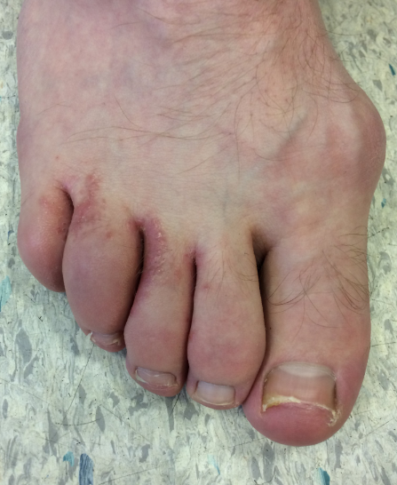

Usually the lining of the joint that gets affected
Anyone at any age can get inflammatory arthritis

#### Rheumatoid Arthritis

^ab6a7d

- Autoimmune
- Most common presents at 40-50s y/o
- 3:1 F:M
- Usually small joints of the hands and feet
- Other organs can be effected
- 80% positive Rheumatoid Factor blood test
- Positive anti-CCP antibody
  

#### Psoriatic Arthritis

- About 15% of people with psoriasis will develop psoriatic arthritis
- Dactylitis & nail changes (onycholysis)
- Increased CV risk
  

#### Axial Spondylarthritis

- Inflammatory back pain
- Young people
- Can cause red inflamed eyes (iritis)
- Untreated bones can fuse and cause an immobile spine

## Causes/Factors

## Symptoms

- Morning stiffed more than 30 mins

## Signs

- Definite joint swelling

## Diagnostic Tests

- $\uparrow$ CRP (inflammation somewhere)
- $\uparrow$ anti-CCP antibodies

## Management

Reduce inflammation and make patient feel better. Look out for other BS affected. Keep patient well and doing hobbies

- very treatable

## Complications/red Flags
