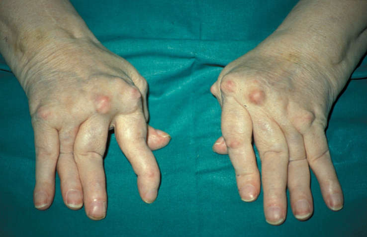

Usually the lining of the joint that gets affected
Anyone at any age can get inflammatory arthritis

## Rheumatoid Arthritis

^ab6a7d
A systemic autoimmune disorder affecting synovial joint membrane with extra-articular manifestations 

- Autoimmune
- Most common presents at 40-60s y/o
- 3:1 F:M
- Other organs can be effected
- 80% positive Rheumatoid Factor blood test
- Positive anti-CCP antibody

#### Signs
- Symmetrical polyarthritis - most common joints: MCP, wrist, PIP, knee, MTP, shoulder, ankle, C-spine, hip, elbow, TMJ
- Rheumatoid nodules (elbow and lungs)
  

#### Symptoms

- Inflammation with swelling, tenderness, warmth and decreased ROM.
- Worse in the morning - improved with movement

Extra-articular:
- Generalised malaise, fatigue
- Pericardtis or percardial effusion
- Vasculitis
- Pulmonary fibrosis

#### Diagnostic Tests

- **Bloods** - $\uparrow$ ESR, CRP - FBC: anaemia of chronic disease, thrombocytosis, leukocytosis
- **Anti-CCP antibody** - more specific and sensitive than RF 
- **XR**/MRI of the area looking for erosions and damage
- **Joint aspirations** - synovial fluid with increased WCC and protein

#### Management

1. **Disease-Modifying Antirheumatic Drugs (DMARDs):**
    - **Methotrexate, Hydroxychloroquine, Sulfasalazine:** Common first-line medications.
    - **Biologic DMARDs:** Target specific pathways in the immune system.
    - **JAK Inhibitors:** Janus kinase inhibitors that modulate the immune response.
2. **Nonsteroidal Anti-Inflammatory Drugs (NSAIDs):** For pain and inflammation.
3. **Corticosteroids:** Short-term use to control acute flares.
4. **Physical Therapy:** Exercises to maintain joint function and flexibility.
5. **Joint Replacement Surgery:** In severe cases where joint damage is extensive.

> [!Info] Biological therapy
> TNF inhibitors eg adalimimab and immunomodulators such as rituximab are used in adults with highly active disease who have failed to respond to 2 DMARDs
#### Psoriatic Arthritis

- About 15% of people with psoriasis will develop psoriatic arthritis
- Dactylitis & nail changes (onycholysis)
- Increased CV risk
  

#### Axial Spondylarthritis

- Inflammatory back pain
- Young people
- Can cause red inflamed eyes (iritis)
- Untreated bones can fuse and cause an immobile spine

 
