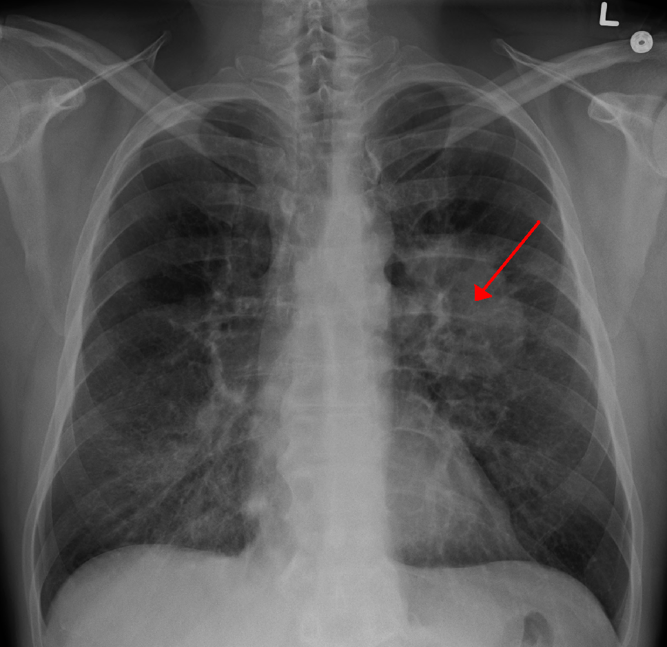

Carcinoma of the bronchus - second most common cancer in UK, only 5% cured

## Causes/Factors

- Smoking (90%)
- asbestos
- chromium
- arsenic
- iron oxides
- radon gas

### Histology

Non small cell lung carcinoma:

- squamous
- adenocarcinoma
- large cell

Small cell

- arise from endocrine cells -> excrete peptides -> paraneoplastic syndromes

## Symptoms

- cough
- haemoptysis
- dyspnoea
- chest pain
- weight loss

## Signs

- **[[clubbing]]** of fingers
- anaemia
- [[pleural effusion]]
- hepatomegaly
- metastasis - lymphadenopathy

## Diagnostic Tests

- Made on histology (biopsy)
- Can see tumour of CXR
  

## Management

- Pemetrexed + (cisplatin) chemotherapy
- Surgery hard to evaluate
- Radiotherapy controversial

## Complications/red Flags

Poor prognosis in general

- phrenic + recurrent laryngeal nerve palsy (mass impinges)
- [[Lambert-Eaton Syndrome]]
