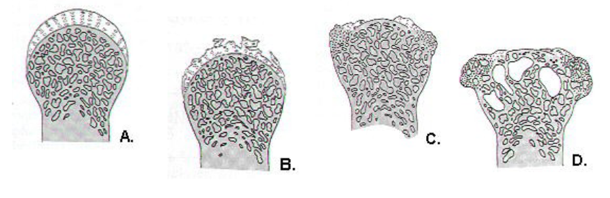

---
tags:
  - Rheumatology
  - MSK
title: Osteoarthritis
date created: Tuesday, August 1st 2023, 5:40:21 pm
date modified: Wednesday, August 2nd 2023, 10:20:03 pm
---

"Wear and tear" - nothing to do from immune system

1. Cartilage flakes off
2. Fragments of cartilage triggers slight inflammatory reaction
3. Bone form cysts as tries to remodel

Affects weight bearing joints
## Causes/Factors

- Age
- Occupation
- Athlete (doing something to accelerate wear)

## Signs 

- Heberen's nodes (DIP joint)
- Bouchard's nodes (PIP joint)
- Crepitus over joint 
- Inflammation around the joint

## Symptoms

- Increasing pain over months/yeras
- Siffness and reduced range of movement 
- Referred pain to the joint below
- Reduced power due to muscle wastage from reduced use) 

No systemic features or early morning stiffness. This is seen in [[Inflammatory Arthritis#Rheumatoid Arthritis|RA]]
## Diagnostic Tests

- Clinical examination
- XR AP + lateral of affected joint
1. **L**oss of joint space
2. **O**steophyte formation (bony spurs protrude out)
3. **S**clerosis (underlying bone becomes hard)
4. **S**ubchondrial cyst

- Normal CRP and antibodies
- Does not affect other organs

## Management

Conservative:
- analgesia - paracetamol (+ codeine if bad). NSAIDs for a short period of time
- intraarticular steroids give short term improvement when there is a painful joint effusion 

Systemic steroids are not used

Surgical: 
- total joint replacement
- this lasts about 20 years

## Complications/red Flags

- Total hip replacement dislocation 