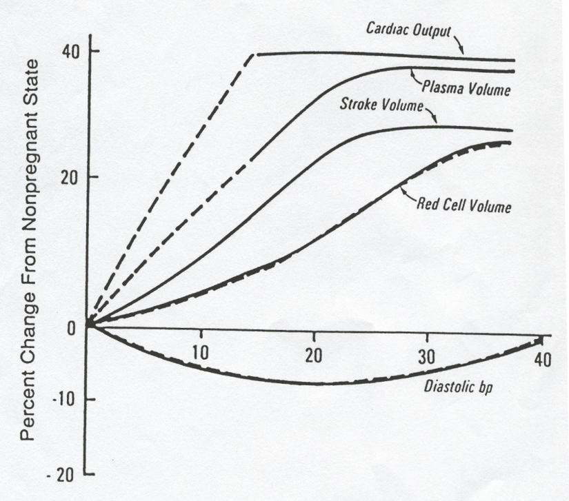

Pre-existing conditions and non-obstetric disease cause more maternal deaths in the UK than obstetric complications

Pregnant women should receive the same investigations and treatments as non-pregnant patients with avoidance of harm to the foetus wherever possible

## Physiological Changes

| System         | Normal pregnancy                                                                                                                                                                                                            | Consider pathology                                                  |
| -------------- | --------------------------------------------------------------------------------------------------------------------------------------------------------------------------------------------------------------------------- | ------------------------------------------------------------------- |
| Cardiovascular | a fall in BP before week 20 (rises back up)   Increased HR, SV & CO                                                                                                               | persistent BP >140/90 might indicate [[Pre-eclampsia]]              |
| Respiratory    | Compensated respiratory alkalosis    No change in PEFR or VC    Altered chemoreceptor sensitivity + $\uparrow$ $O_2$ consumption -> $\uparrow$ RR + 10%                                                         | Serum bicarb <18 mmol/L    Decreased PEFR    RR <20/min |
| Renal          | $\uparrow$ renal perfusion, GFR, protein excretion   $\downarrow$ urea, creatinine    bladder capacity decreases    RAAS increased in 1st trimester - smooth muscle dilation    increased risk of UTIs | Creatinine >85 $\micro$mol/L (eGRF not valid in pregnancy)          |
| GI             | lower oesophageal pressure    altered appetite    decrease in motility    $\uparrow$ water reabsorption    constipation, nausea, heartburn                                                          |                                                                     |
| Haematology    | Decreased clot lysis (reduced protein S, APC resistance, increased plasminogen activator inhibitors)  Increased clot formation (increased factors I, V, VII, VIII, IX, X, XII)                                           |                                                                     |

## Radiology

If the uterus is positioned outside the imagining field of view, the radiation dose to the foetus is minimal.
Exposure from the following is well below the threshold of risk to the foetus:

- Plain radiograph: chest, extremities, spine
- CT: head, chest (but consider radiation to maternal breast in pregnancy

Ultrasound and MRI are generally preferred when imaging abdomen

## Drugs

Should always be a balance of risk - drugs different again in lactation

| Considered safe                                                                       | Contraindicated                     |
| ------------------------------------------------------------------------------------- | ----------------------------------- |
| Penicillins                                                                           | Tetracycline/doxycycline            |
| Macrolides                                                                            | Ciprofloxacin                       |
| Low molecular weight heparin                                                          | Trimethoprim (1st trimester)        |
| Aspirin                                                                               | NSADs (3rd trimester)               |
| Labetalol                                                                             | ACEi                                |
| Nifedipine                                                                            | ARA                                 |
| Adenosine                                                                             | Mycophenolate                       |
| Prednisolone                                                                          | Warfarin                            |
| Treatment for asthma: salbutamol, ipratropium, aminophylline, leukotriene antagonists | Live vaccines (MMR, BCG, varicella) |  
