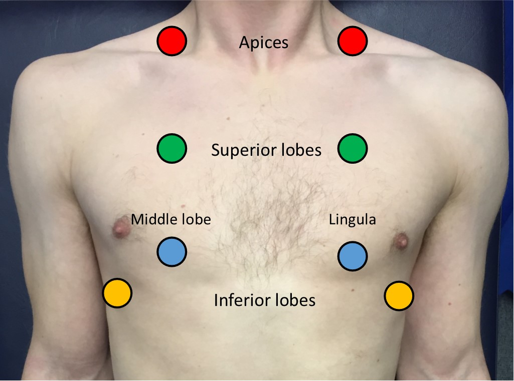

## Introduction

- **Wash hands** (and don PPE if needed)
- **Introduce yourself** (name and role)
- Confirm patient's **name** and **DOB**
- Explain what the examination involves
- Gain consent to continue
- Ask if patient in any **pain** before continuing

## General Inspection

#### Clinical Signs

- Cyanosis
- Shortness of breath
- Cough - wet: [[pneumonia]], [[bronchiectasis]], [[COPD]], [[Cystic Fibrosis]] dry: [[asthma]], [[interstitial lung disease]]
- Wheeze/stridor
- Pallor
- Oedema
- Cachexia - malignancy and other end-stage respiratory diseases

#### Objects and Equipment

- Oxygen delivery devices - type & rate
- Sputum pot
- Other medical equipment - oxygen, ECG, medications, catheters (note volume and colour), IV access
- Cigs or vapes

## Hands

#### Inspection

- Colour: cyanosis of the hands may suggest underlying hypoxaemia.
- **Tar staining:** caused by smoking, a significant risk factor for respiratory disease (e.g. COPD, lung cancer).
- **Skin changes:** bruising and thinning of the skin can be associated with long-term steroid use (e.g. asthma, COPD, interstitial lung disease).
- Joint swelling or deformity: may be associated with rheumatoid arthritis which has several extra-articular manifestations that affect the respiratory system (e.g. pleural effusions/pulmonary fibrosis).

##### Finger [[Clubbing]]

Most likely causes to come up in resp exam OSCE is [[Lung Tumours]], [[interstitial lung disease]], [[Cystic Fibrosis]], [[bronchiectasis]]

- Schamroth’s window test

##### Fine Tremor

Ask the patient to hold out their hands in an outstretched position and observe for a fine tremor which is typically associated with **beta-2-agonist** use (e.g. salbutamol).

##### Asterixis (flapping tremor)

In context of resp exam most likely underlying cause is $CO_2$ retention due to [[Respiratory Failure#Type II|Type II respiratory failure]]. [[Hepatic encephalopathy]] and uraemia are other causes

- Ask patient to stick arms out and cock hands back for 30 seconds

##### Temperature

Place dorsal aspect of your hand onto patients to assess temperature

##### Radial Pulse - Rhythm and Rate

Bounding and tachycardic in CO2 retention

- 30 seconds and x2

##### Respiratory Rate

Whilst still palpating the radial pulse assess the patient's respiratory rate. Note any asymmetries in expiratory and inspiratory phases

- Report breathing pattern and respiratory effort. Asymmetries in breathing , tachypnoea, bradypnoea
  

## Face

#### General

- Plethoric complexion: a congested red-faced appearance associated with polycythaemia (e.g. [[COPD]]) and $CO_2$ retention (e.g. [[Respiratory Failure#Type II|type II respiratory failure]]).

#### Eyes

- Conjunctival pallor: suggestive of underlying anaemia*.* Ask the patient to gently pull down their lower eyelid to allow you to inspect the conjunctiva.
- Ptosis, miosis and enophthalmos: all features of [[Horner's Syndrome]] (anhydrosis is another important sign associated with the syndrome). Horner’s syndrome occurs when the sympathetic trunk is damaged by pathology such as lung cancer affecting the apex of the lung (e.g. Pancoast tumour).

#### Mouth

- Central cyanosis: bluish discolouration of the lips and/or the tongue associated with hypoxaemia.
- Oral candidiasis: a fungal infection commonly associated with steroid inhaler use (due to local immunosuppression). It is characterised by pseudomembranous white slough which can be easily wiped away to reveal underlying erythematous mucosa.

## Neck

#### Jugular Vein

##### Jugular Venous Pressure

Indirect measure of central venous pressure (IJV connects to right atrium without any valves). Raised JVP indicates **venous hypertension** $\rightarrow$ pulmonary hypertension $\rightarrow$ [[Heart Failure|right-sided heart failure]]

1. Position the patient in a semi-recumbent position (at 45°).
2. Ask the patient to turn their head slightly to the left
3. Inspect for evidence of IJV running between the medial end of the clavicle and the ear lobe, under the medial aspect of the sternocleidomastoid
4. Measure the JVP by assessing the vertical distance between the **sternal angle** and the **top of the pulsation point of the IJV** (in healthy individuals, this should be **no greater than 3 cm**).

##### Hepatojugular Reflux Test (not Performed in an OSCE)

The hepatojugular reflux test involves the application of pressure to the liver whilst observing for a sustained rise in JVP.

- In healthy individuals, this rise should last **no longer than 1-2 cardiac cycles** (it should then fall).
- If the rise in JVP is sustained and equal to or greater than 4cm this is deemed a **positive result**.

A **positive hepatojugular reflux result** suggests the **right ventricle is unable to accommodate an increased venous return**, but it is **not diagnostic** of any specific condition.

##### Trachea Position

Anything that can shift the mediastinum can cause tracheal deviation

1. Ensure patient neck is comfortable - position chin slightly downwards
2. Dip your index finger into the thorax beside the trachea
3. Gently apply side pressure to locate trachea
4. Compare this space to the other side of the trachea using the same process
5. A difference in the amount of space between the sides suggests the presence of tracheal deviation

##### Assess Cricosternal Distance?

##### Lymph Nodes

Position patient upright and examine from behind if possible. Use pads of the 2nd, 3rd and 4th fingers to press and roll the lymph nodes to feel.

1. Submental
2. Sub-mandibular
3. Post and pre-auricular
4. Occipital
5. Anterior and posterior cervical
6. Supraclavicular

Causes include [[Lung Tumours]] [[Tuberculosis]] and [[sarcoidosis]]

## Chest

#### Inspection

- Scars - check both axillae too
- Chest wall deformities
  - Asymmetry
  - Pectus excavatum - caved-in or sunken appearance
  - Pectus carinatum - protrusion of the sternum and ribs
  - hyperexpansion (barrel chest) associated with [[asthma]] and [[COPD]]

##### Apex Beat

- Typically located in 5th intercostal space in midclavicular line
- Displacement of apex beat from its usual location can occur due to anything that shifts mediastinum

##### Assess Chest Expansion

Can be assessed either anteriorly or posteriorly

1. Place hands around patients chest inferior to the nipples
2. Warp fingers around other side
3. Bring thumbs together so they touch
4. Ask patient to breath in
5. Movement of thumbs should move symmetrically upwards & outwards

Pneumothorax/pleural effusion/collapsed lobe

### Percussion of Chest

- **Resonant:** a normal finding
- Dullness: suggests increased tissue density (e.g. cardiac dullness, consolidation, tumour, lobar collapse).
- Stony dullness: typically caused by an underlying [[Pleural Effusion]]
- Hyper-resonance: the opposite of dullness, suggestive of decreased tissue density (e.g. [[pneumothorax]]).

### Auscultate Lung Fields

Ask the patient to relax and breathe deeply in and out through their mouth

Normal vesicular breathing:
![[z_attachments/normal breathing.mp3|normal breathing]]

#### Quality of Breath Sounds

- Vesicular: the normal quality of breath sounds in healthy individuals.
- Bronchial: harsh-sounding (similar to auscultating over the trachea), inspiration and expiration are equal and there is a pause between. This type of breath sound is associated with consolidation.

#### Added Sounds

- Wheeze: often associated with [[asthma]], [[COPD]] and [[bronchiectasis]] - lower airways
  ![[z_attachments/wheeze.mp3|wheeze]]
- Stridor: a high-pitched extra-thoracic breath sound resulting from turbulent airflow through narrowed upper airways. Stridor has a wide range of causes, including foreign body inhalation (acute) and subglottic stenosis (chronic).
  ![[z_attachments/inspiratory stridor.mp3|inspiratory stridor]]
- Coarse crackles: associated with [[pneumonia]], [[bronchiectasis]] and pulmonary oedema.
  ![[z_attachments/coarse crackles.mp3|coarse crackles]]
- Fine end-inspiratory crackles:  associated with [[pulmonary fibrosis]]
  ![[z_attachments/fine crackles.mp3|fine crackles]]

##### Vocal Resonance

1. Ask the patient to say "99" each time stethoscope is placed down in the same tone
2. Auscultate all major regions comparing each side

Increased volume over an area suggests increased tissue density (e.g. consolidation, tumour, lobar collapse).

Decreased volume over an area suggests the presence of fluid or air outside of the lung (e.g. pleural effusion, pneumothorax).

# Repeat All of above for Posterior Chest

Except apex beat and chest expansion if already done

## Final Steps

- Assess for sacral and pedal oedema - HF
- Assess calves for signs of [[Deep Vein Thrombosis]]
  ( - Inspect for evidence of [[erythema nodosum]], which can be associated with [[sarcoidosis]])

## To Complete the Exam

- **Explain** to the patient that the examination is now **finished**.
- **Thank the patient** for their time.
- **Dispose of PPE** appropriately and **wash your hands**.
- **Summarise** your findings.

## Further Assessments and Investigations

- Check **oxygen saturation $SpO_2$** and provide if needed
- Check other vital signs - temp & blood pressure
- Take a sputum sample
- **For [[asthma]]** - perform a peak flow
- Request chest X-Ray if abnormalities noted
- Take ABG if indicated
