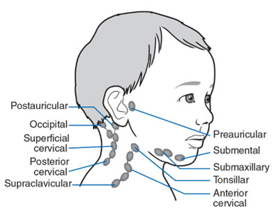

---
tags:
  - Examination
  - OSCE
  - Incomplete
title: Thyroid Exam
date created: Tuesday, August 1st 2023, 5:40:21 pm
date modified: Wednesday, August 2nd 2023, 10:20:03 pm
---

## Gather equipment
- Stethoscope
- Glass of water
- Tendon hammer
- Piece of paper

## Introduction

- **Wash hands** (and don PPE if needed)
- **Introduce yourself** (name and role)
- Confirm patient's **name** and **DOB**
- Explain what the examination involves
- Gain consent to continue
- Ask if patient in any **pain** before continuing

## General Inspection

#### Clinical Signs
- Weight - weight loss a/w [[Hyperthyroidism]], weight gain a/w [[Hypothyroidism]]
- Behaviour - anxiety and hyperactivity with [[Hyperthyroidism]], low mood with [[Hypothyroidism]]
- Clothing - may be inappropriate for the current temperature
- Hoarse voice - caused by compression of the larnx due to enlargement [[Hypothyroidism]]
- Slurred and slow voice - [[Hyperthyroidism]]

#### Objects and Equipment
- Mobility aids - patients with [[Hyperthyroidism]] can develop proximal myopathy
- Prescriptions - eg levothyroxine 

## Hands

#### Inspection

- Thyroid acropachy - similar appearance to clubbing caused by phalangeal bone overgrowth secondary to [[Grave's disease]]
- Onycholysis - detachment of nail from the bed a/w [[Hyperthyroidism]]
- Palmar erythema - reddening of palms a/w [[Hyperthyroidism]] 

#### Peripheral tremor
A feature of hyperthyroidism due to sympathetic nervous system overactivity

1. Ask patient to stretch out their arms
2. Place a piece of paper across both hands
3. Look for paper movement

#### Radial pulse
Assess for rate and rhythm

Hyperthyroid: $\uparrow$ HR and possibly [[Atrial Fibrillation]]
Hypothyroid: $\downarrow$ HR 

#### Ask to do a blood pressure

## Face

#### Inspect
- Dry skin - [[Hypothyroidism]]
- Excessive sweating - [[Hyperthyroidism]]
- Eyebrow loss - absence of the outer third of eyebrows is a/w [[Hypothyroidism]] 
- Thin hair - [[Hypothyroidism]]

### Eyes

#### Lid retraction
Inspect the eyes from the front and note if sclera is visible above the iris.

![[z_attachments/Pasted image 20230924174644.png]]

Most commonly due to [[Grave's disease]]

Also look for any sign of inflammation due to the retraction.

#### Exophthalmos
Bulging of the eye is budging anteriorly 

- Inspect the eye from the front side and above. 

#### Eye movements
Assess for ophthalmoplegia (paralysis or weakness of the eye muscles) and pain during movement caused by [[Grave's disease]]

1. Ask the patient to keep their head still and follow your finger with their eyes
2. Move your finger in H shape
3. Observe for restrictions and ask about any pain

#### Lid lag
Delay in the descent of the upper eyelid in relation to the eyeball. Can occur secondary to a combination of lid retraction and exophthalmos

1. Hold finger superiorly and ask patient to follow it whilst keeping their head still
2. Move your finger downward whilst looking at upper eyelids for any delay

#### Lymph node palpation 
Assess for any lymphadenopathy which may indicate metastatic spread of primary thyroid malignancy 

1. Submental
2. Sub-mandibular
3. Post and pre-auricular
4. Occipital
5. Anterior and posterior cervical
6. Supraclavicular 

## Thyroid

#### Inspect
Look at middle of the neck for masses, scars, symmetry

- Ask the patient to swallow some water and observe for any mass movement
	- thyroid massess and thyroglossal cysts move upwards with swallowing
	- lymph nodes will move very little
	- invasive thyroid malignancy may not move if tethered to surrounding tissue

- Ask the patient to protrude their tongue 
	- thyroglossal cysts will move upwards 
	- thyroid gland masses and lymph nodes will not move

### Palpation

1. Tell the patient that you're going to stand behind them to feel their thyroid gland
2. Stand behind the patient and ask them to tilt their chin slightly downwards to relax neck muscles
3. Place three fingers of each hand along the midline of the neck below the chin
4. Locate the upper edge of the thyroid cartilage (Adam's apple)
5. Move fingers inferiorly until cricoid cartilage. The thyroid isthmus overlies this area
6. Palpate the thyroid isthmus using the pads of your fingers and each lobe by moving fingers out laterally
7. Ask the patient to swallow some water whilst feeling for symmetrical elevation of the thyroid lobes
8. Ask patient to protrude tongue again and feel instead of look 

Assess for: 
- Size
- Symmetry
- Consistency
- Masses - e.g. solitary node rather than diffuse swelling
- Thrills (increased vascularity due to hyperthyroidism)

If a mass is noted assess its **position, shape, consistency and mobility**

**Possible findings**
- Thyroglossal cyst - most common congenital abnormality of the neck
- Goitre
	- Diffuse - hyperplasia of thyroid tissue present in both hyper- and hypo- thyroidism 
	- Uninodular - single nodule that may be actively producing thyroid hormones
	- Multinodular - may also be active or inactive
- Mass

## Trachea

#### Inspect
Look for any deviation

#### Percussion
Percuss the sternum moving downwards from the sternal notch to assess for retrosternal dullness caused by a large thyroid mass 

#### Auscultation
Auscultate each lobe of the gland for a bruit using the bell of the stethoscope. A bruit indicates increased vascularity a/w [[Grave's disease]]

## Further tests

#### Reflexes
Used to screen for hyporeflexia in [[Hypothyroidism]]. Only need to assess for one so probably do knee jerk as its the easiest to get

#### Complications to watch out for

**Pretibial myxoedema** - diffuse mucinosis which presents as waxy discoloured induration of the skin as a rare complication of [[Grave's disease]]

![[z_attachments/Pasted image 20230924182318.png|283]]

**Proximal myopathy** - potential complication of both multinodular goitre and [[Grave's disease]]. Patients develop wasting of proximal musculature. To screen ask the patient to stand from a sitting position with their arms crossed. 

## To Complete the Exam

- **Explain** to the patient that the examination is now **finished**.
- **Thank the patient** for their time.
- **Dispose of PPE** appropriately and **wash your hands**.
- **Summarise** your findings.

## Further Assessments and Investigations
- **Thyroid function tests:** these include TSH, T3 and T4.
- **ECG:** should be performed if an irregular pulse was noted to rule out atrial fibrillation.
- **Further imaging:** an ultrasound scan of the neck to further assess any thyroid lumps.