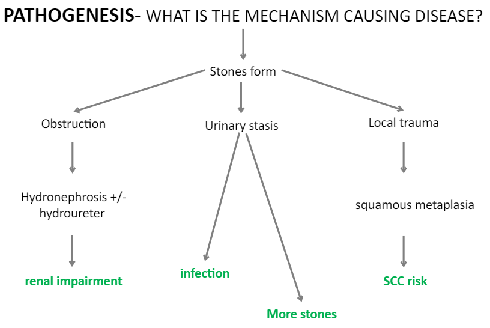

Urinary tract calculi/stones

Can form anywhere from renal calyx to bladder

Types:

- Calcium (70%)
- Urate (5%)
- Cystine (1%)
- Struvite stones, magnesium ammonium phosphate (staghorn calculi) (15%)

## Causes/Factors

- Raised associated mineral

  - Hypercalcaemia eg parathyroid adenoma
  - Raised urate eg [[gout]]

- Dehydration
- Stagnant urine

Leads to soluble material to precipitate out

## Clinical Features

Pain

- URETER: Classic "loin to groin" pain
- BLADDER: lower abdo pain
- URETHRA: dysuria

- Haematuria

## Diagnostic Tests

## Management

## Complications/red Flags

- Infections
