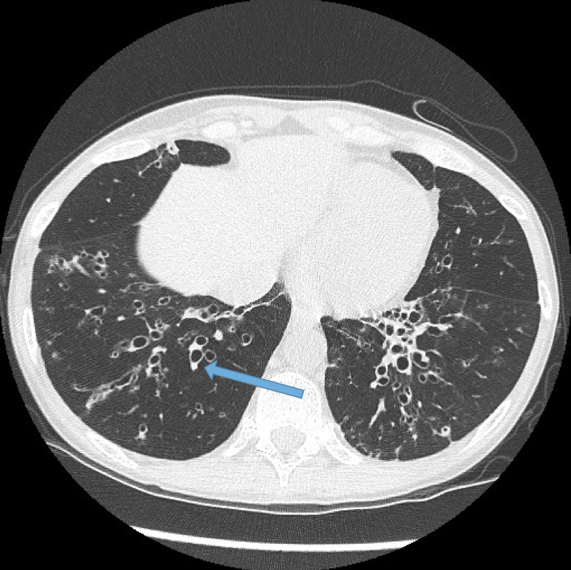

Chronic inflammation of bronchi and bronchioles leading to permanent dilation and thinning. Easily collapsible - obstructive lung disease

## Causes/Factors

- Congenital: [[Cystic Fibrosis]], [[Young's Syndrome]], [[Kartagener's Syndrome]], [[Alpha-1 antitrypsin deficiency]]
- Post-infection: measles, pertussis, [[pneumonia]], [[Tuberculosis]], [[HIV]]
- Other: Immunodeficiencies

## Symptoms

- Persistent productive cough (green/yellow colour)
- Dyspnoea
- Halitosis (bad breath)
- Repeated chest infections

## Signs

- **Finger [[clubbing]]**
- Coarse inspiratory crepitations heard
- Hypoxaemia
- Hypercapnia (high $CO_2$)

## Diagnostic Tests

- Sputum culture
- CXR/high res CT to assess extent - signet ring sign - bronchioles larger than arteries (abnormal)
  

- ABG ($\downarrow PaO_2, \uparrow PaCO_2$)

## Management

- Airway clearance techniques & mucolytics
- Antibiotics - nebulised for pseudomonas
- Maintaining body weight/nutrition
- Corticosteroids
- Surgery if localised
