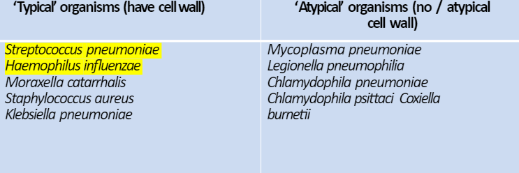
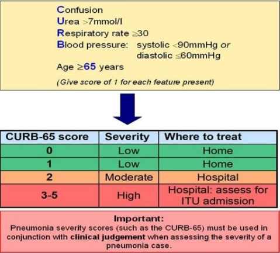

---
tags:
  - Respiratory
title: pneumonia
date created: Tuesday, August 1st 2023, 5:40:21 pm
date modified: Wednesday, August 2nd 2023, 10:20:03 pm
aliases:
  - Pneumonia
---

An acute lower respiratory tract infection associated with fever and other abnormal chest symptoms and signs

## Causes/Factors

- Community acquired (CAP) - most common streptococcus pneumoniae. Occurring outside of hospital or within 48hr of admission
  
  

- Hospital acquired (HAP) - after 48hs from admission
- Ventilator associated (VAP)
- Aspiration pneumonia

- Immunocompromised patient - patients recurrently coming with a CAP is an indicator of HIV - esp if organism is weird

## Symptoms

- Fever
- Rigors
- Anorexia
- Dyspnoea
- Productive cough
- Pleural pain

## Signs

- Pyrexia
- Cyanosis
- Confusion - may be only sign in elderly patients
- Tachypnoea
- Tachycardia
- Hypotension
- Hypoxia
- Bronchial breathing (harsh breath sounds) and crackles heard

## Diagnostic Tests

- CXR: showing consolidation
- Blood/sputum culture
- Bronchoscopy if risk of infection for bloods

## Management

ABCDE

- Fluids
- Oxygen
- Antibiotics
- Assisted ventilation

## Complications/red Flags

- Type 1 [[Respiratory Failure]] ($PaO_2 < 8kPa$)
- Hypotension <- vasodilation/dehydration <- sepsis
- [[Atrial Fibrillation]] - common in elderly, usually resolves with treatment
- [[Pleural Effusion]] - inflammation of pleura leading to fluid build up
- [[Empyema]] - pus in pleural space, should be drained with chest drain
- [[Lung Abscess]]
- [[Pericarditis]] and [[myocarditis]]
- [[Jaundice]] - usually cholestatic - may be due to sepsis or secondary to antibiotic treatment (esp. flucloxacillin and co-amoxiclav)
