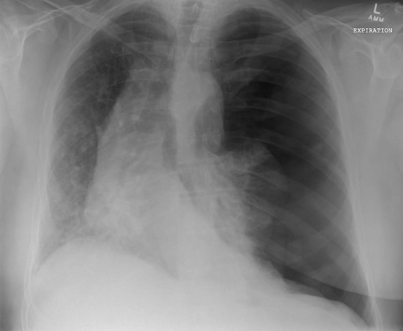

Air getting in pleural cavity causing collapse of the lung

Becomes a tensions pneumothorax when the pressure causes a shift in the mediastinum -> impairment of cardiopulmonary system

## Causes/Factors

- [[COPD]]
- [[asthma]]
- [[pneumonia]]
- [[Lung Abscess]]
- [[Cystic Fibrosis]]
- Trauma
- Spontaneous

## Symptoms

Determined by size of air leak and speed at which it occurs

- Chest pain
- Dyspnoea - shallow rapid
- If secondary to [[COPD]] or [[asthma]] may present with sudden deterioration

## Signs

Diagnosis can be made on signs in server cases

- Deviated trachea (tension)
- Reduced breath sounds on the side
- Hypoxia
- Hyper-resonant to percussion

## Diagnostic Tests

- CXR: - Air = black - Deviated mediastinum
  

## Management

- Small pneumothoraxes resolve often without intervention
- For large ones the air needs to be aspirated with a syringe or a chest tube
- Pleurodesis (sticking lung to chest wall) may be used if there is a significant risk of repeat episodes

## Complications/red Flags
