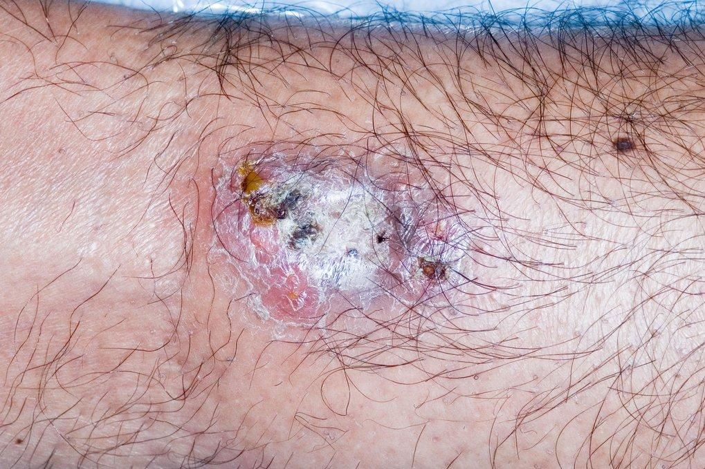

Pyoderma gangrenosum is a rare skin condition that causes painful ulcers. It's usually treatable but can take some time to heal and may leave some scarring. Inflammatory ulcer

## Causes/Factors

- [[inflammatory bowel disease]]
- [[Inflammatory Arthritis]]
- Other autoimmune conditions
## Symptoms

- **Skin Lesions:** Painful ulcers with irregular, undermined edges.
- **Redness and Inflammation:** Surrounding skin may be red and inflamed.
- **Pain:** Lesions can be extremely painful.
- **Rapid Progression:** Lesions may enlarge and deepen quickly.
## Signs

- **Ulcerating Skin Lesions:** Visible ulcers with distinctive appearance - purple boarders.
- **Red and Inflamed Edges:** Erythema and inflammation at the edges of the lesions - undermined edge.

## Diagnostic Tests

- **Clinical Examination:** Assessment of the appearance and characteristics of the skin lesions.
- **Skin Biopsy:** A sample of affected tissue is examined under a microscope.
- **Blood Tests:** To rule out underlying conditions and assess inflammatory markers.

## Management

1. **Topical Therapies:** Steroid creams or ointments applied directly to the lesions.
2. **Systemic Therapies:** Oral or injectable medications to suppress the immune response - prednisolone.
3. **Wound Care:** Keeping the ulcers clean and properly dressed.
4. **Pain Management:** Medications to manage pain and discomfort.
5. **Addressing Underlying Conditions:** Treating any associated autoimmune or inflammatory disorders.

## Complications/red Flags

- **Infection:** Open ulcers can become infected.
- **Worsening Ulcers:** Lesions can enlarge and deepen rapidly.
- **Scarring:** Healing may result in significant scarring.